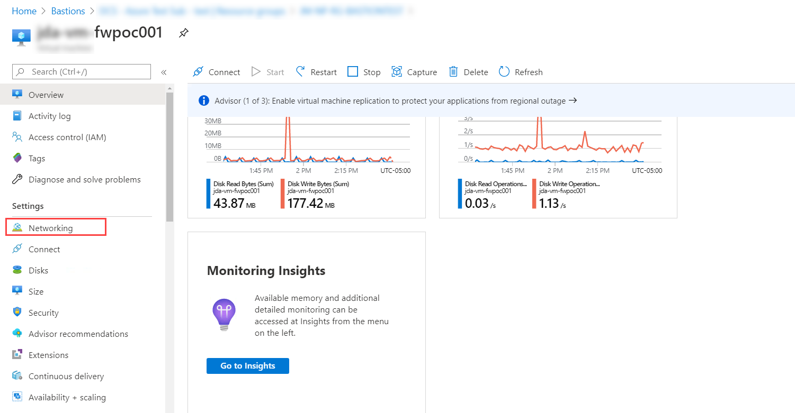
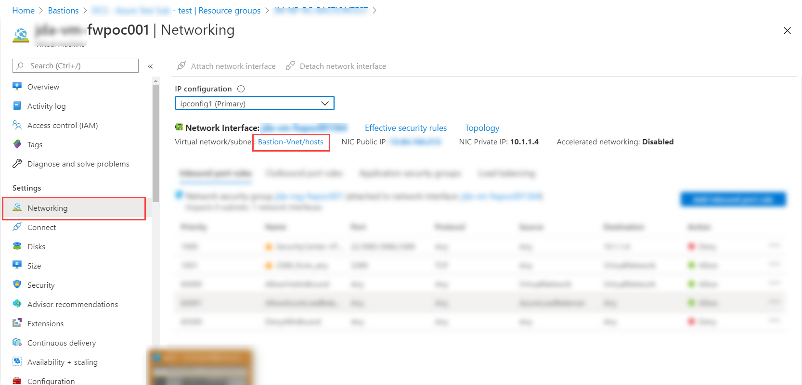
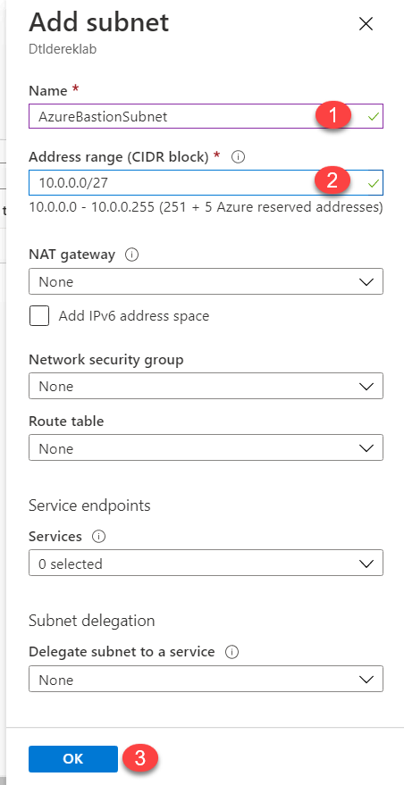
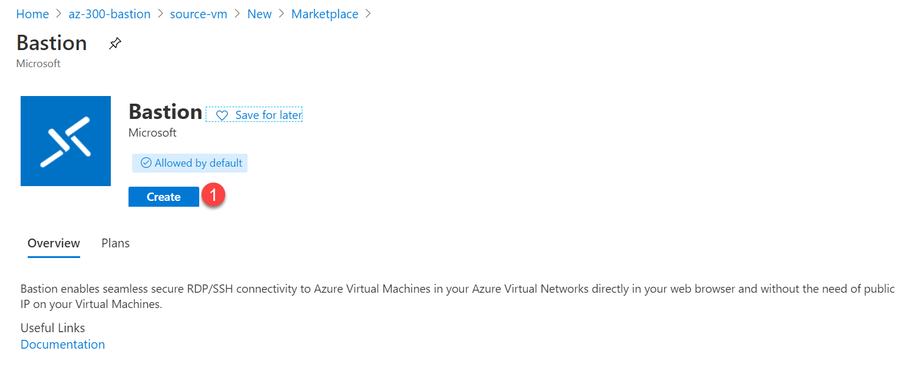
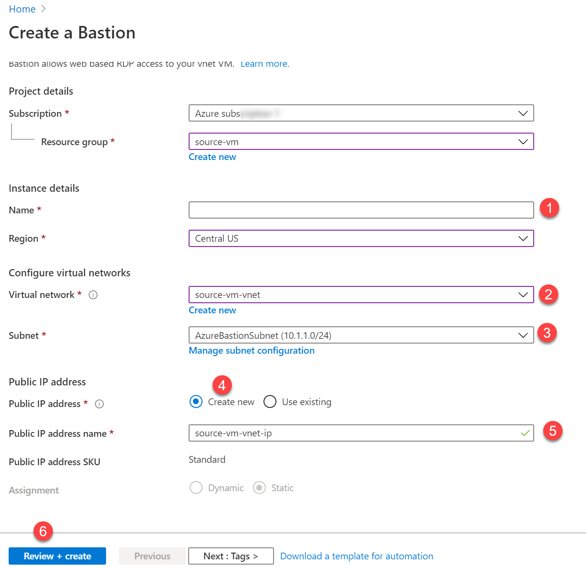
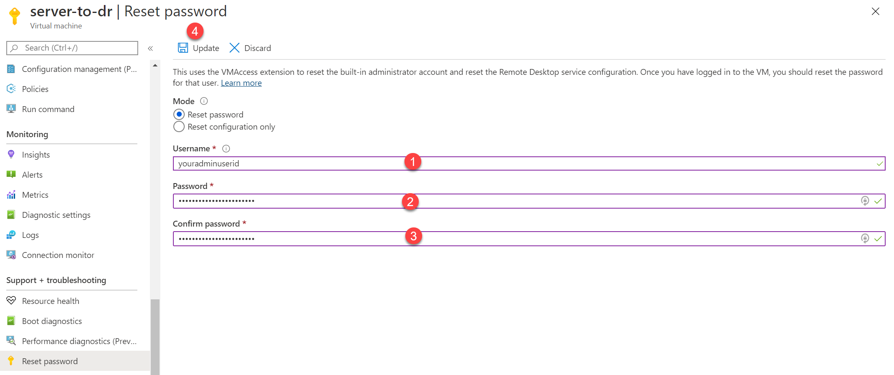
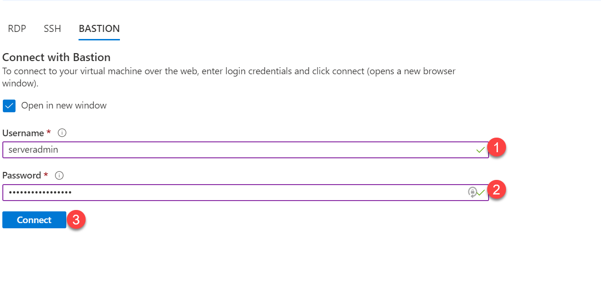
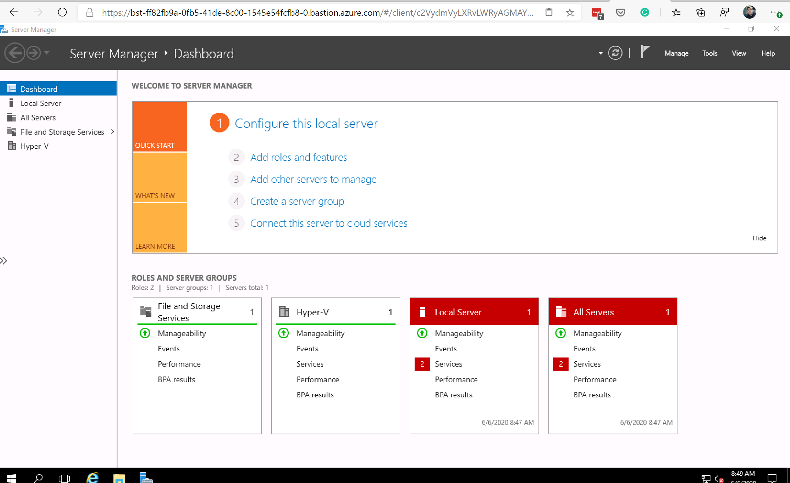

<!--
This is an article template you can use as a quick starting point when writing DigitalOcean tutorials. Once you've reviewed the template, delete the comments and begin writing your outline or article. You'll find some examples of our custom Markdown at the very bottom of the template.

As you write, refer to our style and formatting guidelines for more detailed explanations:

- [do.co/style](https://do.co/style)

Use our [Markdown previewer](https://www.digitalocean.com/community/markdown) to review your article's formatting.

Readers should be able to follow your tutorial from the beginning to the end on a DigitalOcean Droplet. Before submitting your article to the editorial team, please be sure to create a new Droplet and test your article from start to finish on it exactly as written. Cut and paste commands from the article into your terminal to make sure there aren't typos in the commands. If you find yourself executing a command that isn't in the article, incorporate it into the article to make sure the reader gets the exact same results. We will test your article and send it back to you if we run into technical problems, which significantly slows down the publication process.
-->


# How To Leverage Azure Bastion to Connect to Azure Based Virtual Machines

<!-- Use Title Case for all Titles -->

<!-- Learn about the title, introduction, and Goals sections at https://do.co/style#title-introduction-and-goals -->

<!-- Learn about formatting headers at https://do.co/style#headers -->

### Introduction

<!-- Our articles have a specific structure. Learn more at https://do.co/style/structure -->

Many enterprise environments, both large and small, have leveraged a bastion or jump host to ensure that the tools needed for troubleshooting or managing systems are available and configured properly. In many of these cases, the bastion host is another VM that needs to be patched, managed, and secured so it can perform these functions without causing additional risk.

Microsoft has taken some of the capabilities of a jump host and rolled them into the Azure platform. By doing this, there is no longer a need to patch and manage jump hosts within your Azure environment if the tasks you need to perform are just general administration (more on that later). In addition to ensuring there is a method to manage the servers within a VNet, Bastion also allows connection to either public or private IP addresses. Meaning that the systems do not need to be directly Internet facing for this to work. You can remain connected to a server via Azure Bastion while removing the public IP address of the server. Not that this is recommended, but I may or may not have tried this during testing.
In this guide, you will learn what Azure Bastion is, what it is not, and how it might help you manage your Azure environment more securely.

When you're finished, you'll be able to complete the following tasks:
1. Configure virtual networks in preparation for Azure Bastion
2. Enable the Azure Bastion service
3. Connect to virtual machines via Azure Bastion to manage systems in your Azure environment.

## Prerequisites

<!-- Prerequisites let you leverage existing tutorials so you don't have to repeat installation or setup steps in your tutorial.  Learn more at https://do.co/style#prerequisites -->

To get started with Azure Bastion, you'll need the following:

- 1 Windows or Linux server running in Azure <!-- Also specify the amount of RAM the server needs if relevant. -->
- Local or Domain credentials with access to the Azure VM(s)
- A virtual network within the same region as the servers to which you will connect.
- (Optional) A preconfigured subnet within your virtual network called AzureBastionSubnet that is at least a /27
- (Optional) Just-in-time Access configured for the VM you will be using - more info at [Cloudskills.io](https://cloudskills.io/blog/azure-just-in-time). <!-- link to just in time post at cloudskills -->

<!-- Example:
* One Ubuntu 18.04 server with at least 1GB of RAM set up by following [the Ubuntu 18.04 initial server setup guide](https://www.digitalocean.com/community/tutorials/initial-server-setup-with-ubuntu-18-04), including a sudo non-root user and a firewall.
* Nginx installed on your server, as shown in [How To Install Nginx on Ubuntu 16.04](https://www.digitalocean.com/community/tutorials/how-to-install-nginx-on-ubuntu-16-04).
* A domain name configured to point to your server. You can learn how to point domains to DigitalOcean Droplets by following the [How To Set Up a Host Name with DigitalOcean](https://www.digitalocean.com/community/tutorials/how-to-set-up-a-host-name-with-digitalocean) tutorial.
-->

## Step 1 - Configuring the AzureBastionSubnet

<!-- For more information on steps, see https://do.co/style/#steps -->

Azure Bastion uses its predefined subnet to connect to the Virtual Network where it is deployed. This is done to ensure that the service does not run over things that are already on other subnets and helps to keep networking relatively simple. This is called out as an optional step above, but I have found it is easier to configure the networking in advance for Bastion than during the process. There is less changing screens and note-taking to ensure you have all the information you might need at hand.

First, log in to the Azure Portal (https://portal.azure.com) and locate the virtual machine that you want to use with Azure Bastion.

 <!-- image for VM overview Step1-1 -->

Select the networking option from the settings list on the left, locate the network (and subnet) to which the virtual machine is connected, and click the link to go to that resource.

 <!-- image for Vnet and Subnet Step1-2 -->

From the network resource, select Subnets and ensure that there isn't already a subnet called AzureBastionSubnet. Click the Add button to add a subnet and enter the name AzureBastionSubnet (case sensitivity intact). Usually, Azure will suggest a subnet range that is available for the new subnet. Depending on the configuration of other subnets within this virtual network, some massaging may need to be done. If your subnets are generally all the same size, you should have no problems with this suggestion.

Inspect the address range provided and make sure that the network is at least a /27 in size. This is a requirement for Bastion. /24 will work too, but /28 or /29 will not work for this subnet.

 <!-- image for subnet add step Step1-3 -->

Finally, once all of the subnet settings are configured, click Save to create the new AzureBastionSubnet. Remember - each virtual network that you will use with Azure Bastion will need its dedicated subnet for this service. Once it is configured within the needed VNets, you should be all set to move forward enabling Azure Bastion.

<!--
If showing a command, explain the command first by talking about what it does. Then show the command.

If showing a configuration file, try to show only the relevant parts and explain what needs to change.
-->

This step has been easier for me to complete beforehand and makes the Bastion setup much easier, next we will dive into the configuration of Azure Bastion itself.

## Step 2 - Enabling Azure Bastion 

With the networking out of the way, its time to turn on the feature and create an instance of Azure Bastion for the VNet. Please remember, Azure Bastion is configured for each virtual network where it will be used. If your organization has seven virtual networks, then to manage all of the systems across them, seven instances of Azure Bastion will be needed.

My recommendation for the placement of Azure Bastion is to place it in the same resource group and region as your virtual network. Since the bastion service will need to be in the same region as the virtual network this placement seems to fit pretty well.

To configure Azure Bastion, complete the following steps:

1. Log in to the Azure Portal (https://portal.azure.com) 
2. Locate the Virtual Network that Bastion will be configured to use
3. On the Overview page, select the resource group for the VNet
4. Click Add within the Resource Group

 <!-- Step 2-1 Get to Vnet RG --> 

5. Search for Azure Bastion and select it from the list of found results
6. Click Create

 <!-- Step2-2 Create Azure Bastion -->

7. Provde the name of the subscription and Resource Group for Azure Bastion (should be filled in for you)
8. Provide a name for the Azure Bastion resource - typically I name the resource for the vnet it will access
9. Select the Region where this resource will be created - must match the VNet that will be used with this instance
10. Select the Virtual Network to use with Bastion

<b>Note:</b> Because we configured the subnet separately for use with Azure Bastion, the subnet should populate automatically when the VNet is chosen

11. Create or choose an existing public IP - because this will be used just for Bastion, I typically create a new one and name it accordingly.
12. Click Next: Tags if your organization uses tags and provide the necessary tagging
13. Click Review + Create to review your configuration
14. Click Create to build the bastion resource

 <!-- The config items of Azure Bastion Step 2-3 --> 

Configuration does not take too long but is not immediate, you will need to wait maybe 20 minutes for the provisioning to complete.

With the networking and configuration of Bastion out of the way, you are ready to connect to a server using the bastion service.

## Step 3 - Connecting to Virtual MAchines with Azure Bastion

The connection does not seem to be something that would need its section in a guide. Until I started putting this together, I agreed. When the local admin password for my Virtual Machine was not in the location I expected, it occurred to me that setting the password before connection might be useful.

To ensure your virtual machine has a well-known password (only if you have forgotten it or the one you swear is right does not work) let's take a moment to reset the password for a VM and then connect to it with Azure Bastion.

### Reset the Password for your Server
1. Log in to the Azure Portal (https://portal.azure.com) 
2. Locate the server for which you wish to reset the password
2. On the left navigation pane, select Reset Password

 <!--step3-1 Reset password --> 

4. Select the Reset Password radio button
5. Enter the username for the account you are adding or resetting
6. Enter and confirm the new password
7. Click Update and wait a few minutes for the password to reset

Once the password has bee set (or reset) you can use Azure Bastion.

To do so, select the connect option for the virtual server and choose the Bastion tab

 <!-- Step3-2 Bastion connect --> c00kies are Yummy

Enter the username and password that you specified earlier in this section and click Connect.  The default is for the Bastion connection to open a new window or tab in your browser.

 <!--Step3-3 Connecting to Bastion --> 

From here, the process is just like RDP or SSH - the biggest difference is that the display is in a browser. There are sa few caveats at the time of this writing that should be called out, but they are minute and can be worked around.

For Windows VMs, you can copy text in to and out of the virtual server using Azure Bastion (if you allow clipboard access within the browser session). Currently, you cannot copy and paste files into the bastion session. This means if you want to install something, you will need to do one of the following:

1. Have the files stored on a file share that is accessible from the managed server
2. Use an Azure Storage account and mount or browse to it from the managed server
3. Download the installer files from a source on the Internet on the managed server

My favorite here is to put the files in a storage account in Azure, using a file share with approximately 10 GB of space available. Then mount the file share using the connection information provided. This way, I have a place to put temporary things - the storage can be permanent across multiple VMs and used just for files into and out of the managed server(s).

In addition to file movement in and out of VMs using Bastion, you will need to ensure that your network connection to the Bastion instance over port 443 is pretty good - this in and of itself will not be an issue, however if you find yourself using [Just In Time Access](https://cloudskills.io/blog/azure-just-in-time) or have Network Security Groups in play, you may get a notice from Azure when connecting to VMs that your connection to the resource is unreliable.  Check NSG configurations between the client and VM for any out of the ordinary items.

## Conclusion

In this article you configured three things:
1. Azure Networking to support Azure Bastion
2. The Azure Bastion resources for a virtual network
3. The local Admin password for a virtual machine
 
 Now you can use Azure Bastion to connect to virtual machines within a VNet. For the benefit it brings by not needing to maintain security and patching on another host and the fact that no public IP addresses are required, the bastion service is a great connection management tool. Is it perfect? No, but it is a cloud service and like many things in the cloud it will have improvements and changes much faster than traditional technology. 

<!-- Speak  to reader benefits of this technique or procedure and optionally provide places for further exploration. -->


<!-- Some examples of how to mark up various things

This is _italics_ and this is **bold**.

Only use italics and bold for specific things. Learn more at https://do.co/style#bold-and-italics

This is `inline code`. Use it for referencing package names and commands.

Here's a command someone types in the Terminal:

```command
sudo nano /etc/nginx/sites-available/default
```

Here's a configuration file. The label on the first line lets you clearly state the file that's being shown or modified:

```nginx
[label /etc/nginx/sites-available/default]
server {
    listen 80 default_server;
    listen [::]:80 default_server ipv6only=on;

    root <^>/usr/share/nginx/html<^>;
    index index.html index.htm;

    server_name localhost;

    location / {
        try_files $uri $uri/ =404;
    }
}
```

Here's output from a command:

```
[secondary_label Output]
Could not connect to Redis at 127.0.0.1:6379: Connection refused
```

Learn about formatting commands and terminal output at https://do.co/style#code

Key presses should be written in ALLCAPS with in-line code formatting: `ENTER`.

Use a plus symbol (+) if keys need to be pressed simultaneously: `CTRL+C`.

This is a <^>variable<^>.

This is an `<^>in-line code variable<^>`

Learn more about how to use variables to highlight important items at https://do.co/style#variables

Use `<^>your_server_ip<^>` when referencing the IP of the server.  Use `111.111.111.111` and `222.222.222.222` if you need other IP addresses in examples.

Learn more about host names and domains at https://do.co/style#users-hostnames-and-domains

<$>[note]
**Note:** This is a note.
<$>

<$>[warning]
**Warning:** This is a warning.
<$>

Learn more about notes at https://do.co/style#notes-and-warnings

Screenshots should be in PNG format and hosted on imgur. Embed them in the article using the following format:


Learn more about images at https://do.co/style#images-and-other-assets
-->