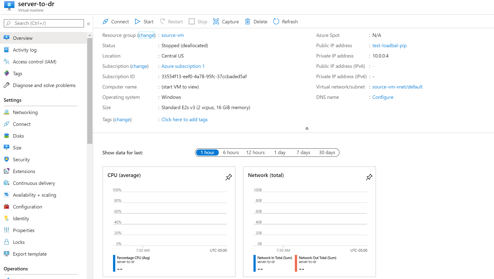
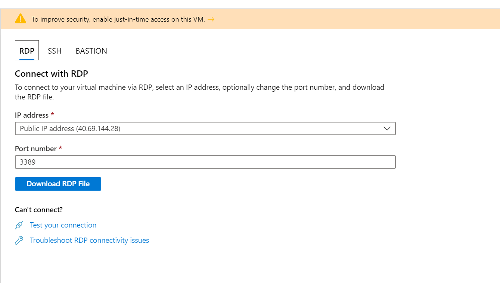
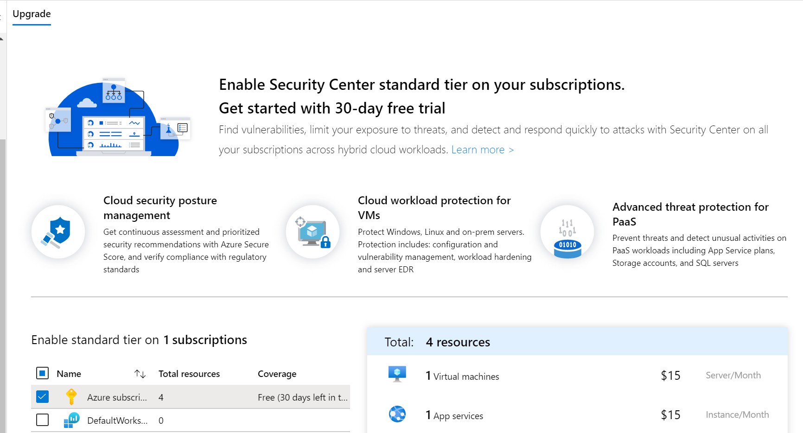
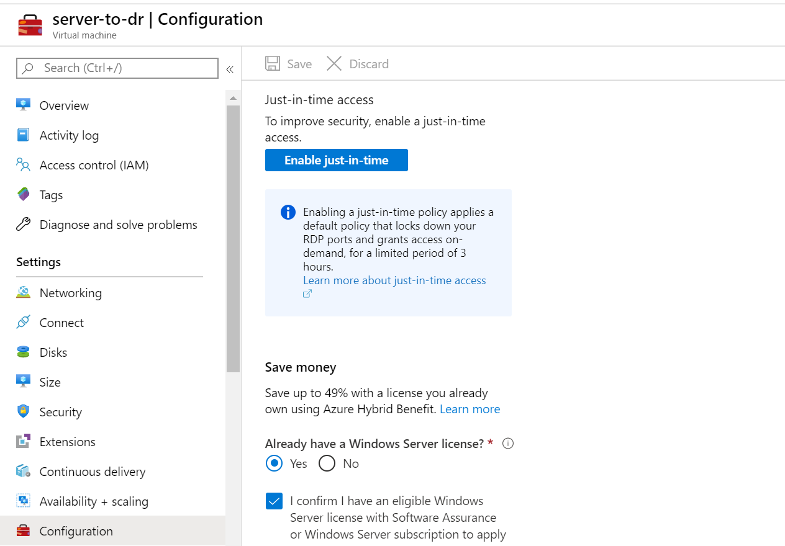
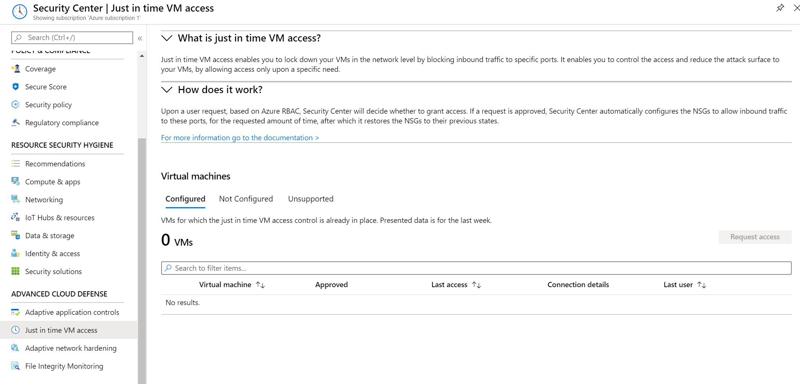
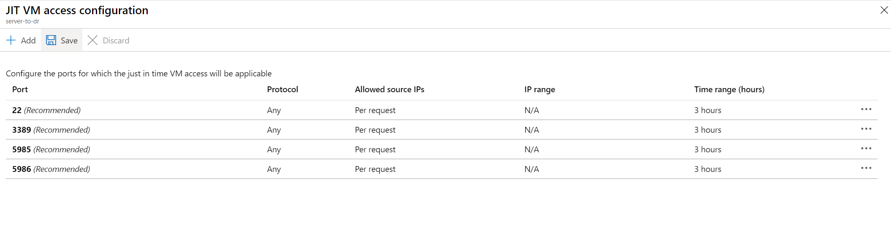
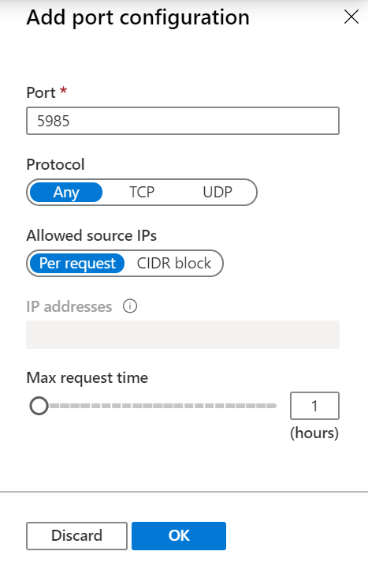
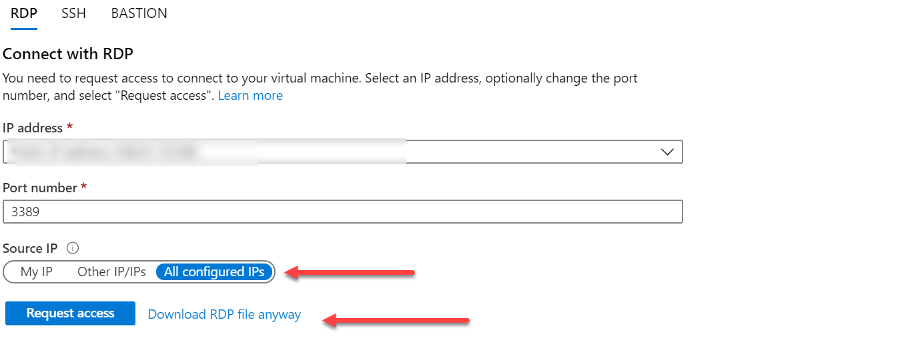
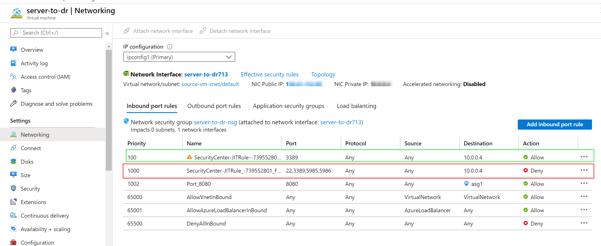

<!--
This is an article template you can use as a quick starting point when writing DigitalOcean tutorials. Once you've reviewed the template, delete the comments and begin writing your outline or article. You'll find some examples of our custom Markdown at the very bottom of the template.

As you write, refer to our style and formatting guidelines for more detailed explanations:

- [do.co/style](https://do.co/style)

Use our [Markdown previewer](https://www.digitalocean.com/community/markdown) to review your article's formatting.

Readers should be able to follow your tutorial from the beginning to the end on a DigitalOcean Droplet. Before submitting your article to the editorial team, please be sure to create a new Droplet and test your article from start to finish on it exactly as written. Cut and paste commands from the article into your terminal to make sure there aren't typos in the commands. If you find yourself executing a command that isn't in the article, incorporate it into the article to make sure the reader gets the exact same results. We will test your article and send it back to you if we run into technical problems, which significantly slows down the publication process.
-->


# Using Just In Time Access to Secure Azure VMs

<!-- Use Title Case for all Titles -->

<!-- Learn about the title, introduction, and Goals sections at https://do.co/style#title-introduction-and-goals -->

<!-- Learn about formatting headers at https://do.co/style#headers -->


<!-- Our articles have a specific structure. Learn more at https://do.co/style/structure -->

Controlling access to servers running in Azure can feel like a daunting exercise. Granting access from certain networks for any users, and allowing access for some users from any location can be quite a bit to take on, especially when your journey into Azure is just getting started. Microsoft has released a service to provide some help with managing this access a bit more "on the fly" called Just-In-Time Access. Once you have seen the simplicity and usefulness of Just In Time access, you will be able to use it against any Azure Virtual Machines to simplify access control and auditing within your environment. 

Using Just In Time Access does provide great and simplified access control features, but is not suitable for all cases and may be a stop-gap for servers until a more suitable solution is found, this will depend on the needs and requirements of an organization. 

In this guide, you will learn what Just-In-Time access is, when it is useful (and not so useful), and how to configure it. 

When you're finished, you'll be able to enable Just-In-Time access for virtual machines in your Azure environment.

## Prerequisites

<!-- Prerequisites let you leverage existing tutorials so you don't have to repeat installation or setup steps in your tutorial.  Learn more at https://do.co/style#prerequisites -->

To configure Just In Time Access, you will need the following:

- An Azure subscription
- One or more virtual machines
- A paid Security Center entitlement for any servers to be used with Just In Time ($15/server/Month) or the 30 day free trial of the service


<!-- Example:
* One Ubuntu 18.04 server with at least 1GB of RAM set up by following [the Ubuntu 18.04 initial server setup guide](https://www.digitalocean.com/community/tutorials/initial-server-setup-with-ubuntu-18-04), including a sudo non-root user and a firewall.
* Nginx installed on your server, as shown in [How To Install Nginx on Ubuntu 16.04](https://www.digitalocean.com/community/tutorials/how-to-install-nginx-on-ubuntu-16-04).
* A domain name configured to point to your server. You can learn how to point domains to DigitalOcean Droplets by following the [How To Set Up a Host Name with DigitalOcean](https://www.digitalocean.com/community/tutorials/how-to-set-up-a-host-name-with-digitalocean) tutorial.
-->

## Step 1 — Locating Just In Time Access

<!-- For more information on steps, see https://do.co/style/#steps -->

In this step, you will locate Just In Time Access from both the VM for which it will be configured and the Security Center where configuration takes place. While the feature works with virtual machines, it is a security feature and is controlled and managed from Security Center. 

First, login to the Azure Portal (https://portal.azure.com) and navigate to the Virtual Machine you'll be using with Just In Time:



Next, before Just In Time is enabled, you will see a banner at the top of the connect screen explaining that you can improve security if you enable Just In Time:

 >]

Finally, visit the Azure Security Center and ensure the VMs you have chosen to use with Just In Time are enrolled in management by security Center.

 

If your subscription is not using the paid version of security center, the upgrade button will be available at the bottom of the getting started page. Select Upgrade to begin a 30 day trial of security center to allow selected VMs to use Just In Time.

<!--
If showing a command, explain the command first by talking about what it does. Then show the command.

If showing a configuration file, try to show only the relevant parts and explain what needs to change.
-->

Security Center is aware of the VMs you have selected for Just In Time, next up you will work through configuring Just In Time specific settings for these virtual machines.

## Step 2 — Enabling Just In Time

The Just in time component can be enabled from the VMs configuration screen or from the security center. If the configuration will be tested on just a couple of machines, handling this at the VMs is likely the quickest method. If you are going to be rolling this out to a large number of machines or want to configure general settings for multiple vms - security center is the most efficient option. Both of these will be covered here.

From an individual server, selecting Enable Just In Time Access from the VM configuration screen is the best method if you are only setting up one virtual machine.

 

Once the enable button is clicked, the machine will be enrolled in Just In Time - it really is that simple. Head over to the Azure Security Center to see the results of your button pressing.

 

Adding machines from the security center is straight forward as well. If you are adding multiple machines, it is even easier.

From the Azure Portal, select the Security Center. From the navigation menu, scroll to the Advanced Cloud Defense block and select Just in time VM Access.

 

The security center displays three tabs - Configured, Not configured, and Unsupported. If the virtual machine configured above still has Just In Time configured, it will be listed on the configured tab. Other VMs will be listed on the Not Configured tab to be setup.

Select the Not Configured tab, there you will see any virtual machines in your azure environment that are able to be configured for Just in Time. To enable the setting, select the check box for the server(s) to configure, then click the Enable JIT on x VMs button to enable it on all of the selected machines.

 

With Just In Time enabled for your virtual machine(s) the last configuration step is to determin the ports to use and the time frame for each connection.

## Step 3 — Configuring Ports and Rules

After enabling Just In Time for servers in Azure, your work is not done just yet. The final configuration step is to set the default time range for an allowed connection and the ports available for Just In Time Access. This section works through setting access on the default ports for a Windows machine and cleans up a port that may not be used.

If you enabled JIT from the Security Center, Azure will take you to the access configuration screen. The default ports listed for configuration are:

22 - used for SSH connections
3389 - used for Remote Desktop Connections to Windows Servers
5985 - used for remote powershell connections over HTTP
5986 - used for remote PowerShell connections over HTTPS

The source IP is configured per request, meaning that the IP address the request is coming from is the IP used for that request - they can be configured for individual IPs or IP ranges. 

The default time range is 3 hours. Because servers in the cloud can be the target of nefarious access attempts, three hours can seem like a very long time. Selecting the elipsis for a specific port will allow you to remove configuration entries for ports your environment does not need.

 

Clicking on the row for a port will bring up the port configuration blade. This allows specification of the port number, the protocol (Any, TCP, UDP), the Allowed source IPs - either a list of single IP addresses or a CIDR range, and the max request time. This time defaults to 3 hours. I would suggest changing it to 1 hour for most servers to limit the time per request allowed.

 

Once you have configured all of the ports needed for your environment and removed the items that are not needed, click the save button at the top of the ports list screen to complete the configuration. Now that the hard work is out of the way, using Just in Time is the last piece of this puzzle.

## Step 4 - Using Just In Time Access

Congratulations! Just In Time is setup for your servers in Azure and ready to keep access to your systems as safe as can be. Now you just need to use it.

To leverage Just In Time Access navigate to the server you want to access in the Azure portal. From there, select Connect in the navigation pane or by choosing the connect button at the top of the overview page. Select RDP from the connect screen for a Windows VM (SSH for Linux) and notice the Request Access button and Source IP options for the connection.

 

Selecting a Source IP will specify where your access is coming from for this connection. Generally, My IP will be the most appropriate connection (and keep the Security team happiest).  Then click Request Access.  If the account you are logged into Azure with has Write access to the VM, your access request will succeed.

This is needed because the networking configuration of the VM will be updated with a rule allowing your connection for the port(s) that are configured and requested by the user. If your user only has read access, it will not be able to write the networking configuration and the setup will fail.  Please note that this update is asyncronous and will take a little bit to take effect. After your request has been processed, click the button to download the RDP file for connection. The rule added by Just In Time, will allow your connection. You will notice that there might be a deny rule for the ports configured for Just In Time.  This is the case because the feature requires a request to happen which adds an allow rule above the deny rule added for Just in time.

 

## Conclusion

In this article you learned how to work with Just In Time Access to virtual machines in Azure. Now you can easily limit access to servers in your Azure environment. One more thing, please remember that Azure servers are online all the time, setting up Just In Time Access may require you to remove more broad rules which might allow connections over standard ports like 22 or 3389. 

Using Just In Time Access instead allows logged access to servers in your environment which can make things more secure and overall easier to manage for you and your organization.

<!-- Speak  to reader benefits of this technique or procedure and optionally provide places for further exploration. -->


<!-- Some examples of how to mark up various things

This is _italics_ and this is **bold**.

Only use italics and bold for specific things. Learn more at https://do.co/style#bold-and-italics

This is `inline code`. Use it for referencing package names and commands.

Here's a command someone types in the Terminal:

```command
sudo nano /etc/nginx/sites-available/default
```

Here's a configuration file. The label on the first line lets you clearly state the file that's being shown or modified:

```nginx
[label /etc/nginx/sites-available/default]
server {
    listen 80 default_server;
    listen [::]:80 default_server ipv6only=on;

    root <^>/usr/share/nginx/html<^>;
    index index.html index.htm;

    server_name localhost;

    location / {
        try_files $uri $uri/ =404;
    }
}
```

Here's output from a command:

```
[secondary_label Output]
Could not connect to Redis at 127.0.0.1:6379: Connection refused
```

Learn about formatting commands and terminal output at https://do.co/style#code

Key presses should be written in ALLCAPS with in-line code formatting: `ENTER`.

Use a plus symbol (+) if keys need to be pressed simultaneously: `CTRL+C`.

This is a <^>variable<^>.

This is an `<^>in-line code variable<^>`

Learn more about how to use variables to highlight important items at https://do.co/style#variables

Use `<^>your_server_ip<^>` when referencing the IP of the server.  Use `111.111.111.111` and `222.222.222.222` if you need other IP addresses in examples.

Learn more about host names and domains at https://do.co/style#users-hostnames-and-domains

<$>[note]
**Note:** This is a note.
<$>

<$>[warning]
**Warning:** This is a warning.
<$>

Learn more about notes at https://do.co/style#notes-and-warnings

Screenshots should be in PNG format and hosted on imgur. Embed them in the article using the following format:


Learn more about images at https://do.co/style#images-and-other-assets
-->