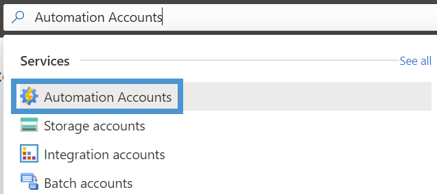
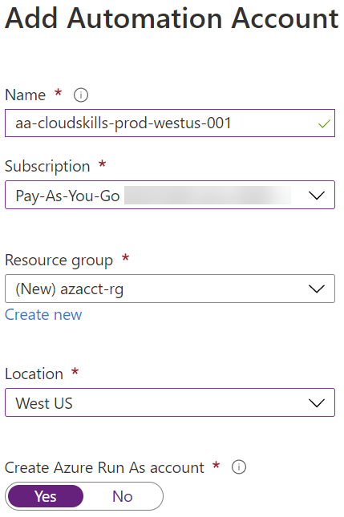
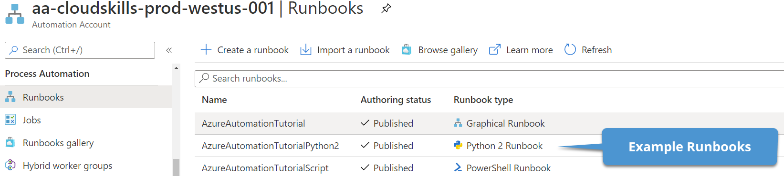
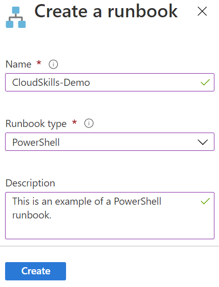
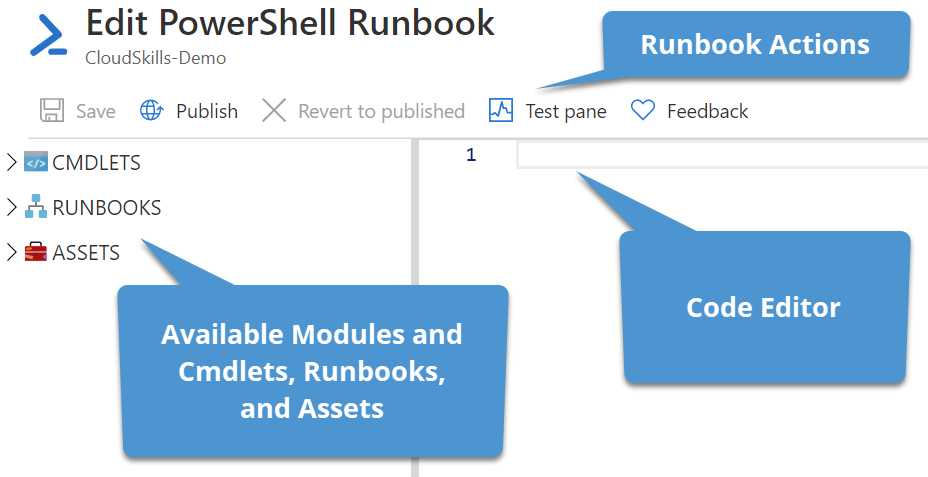
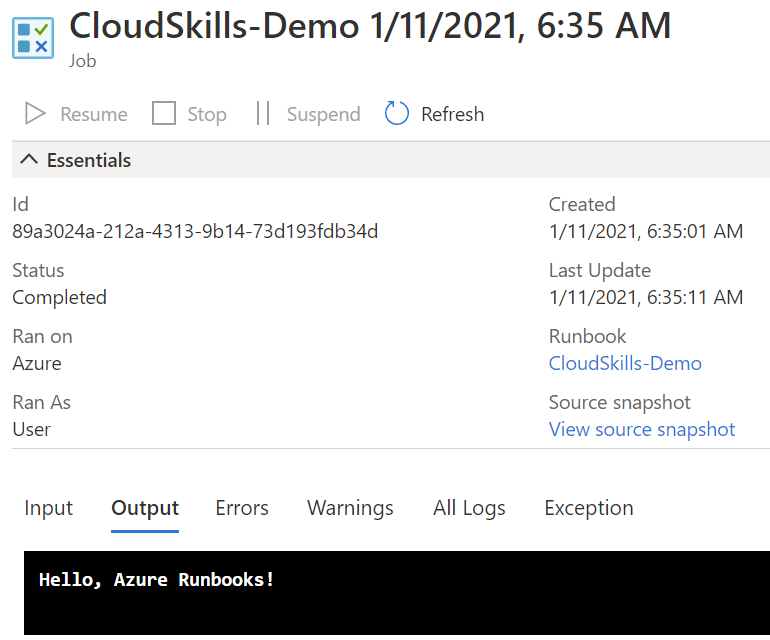
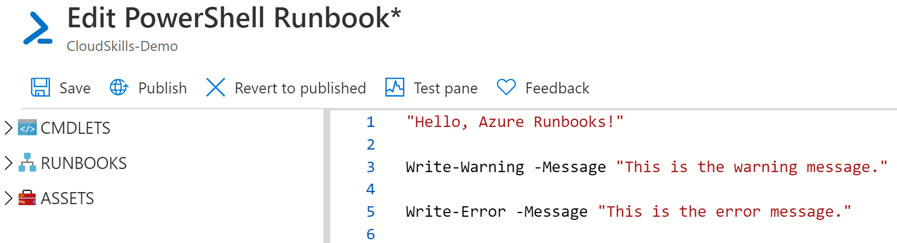
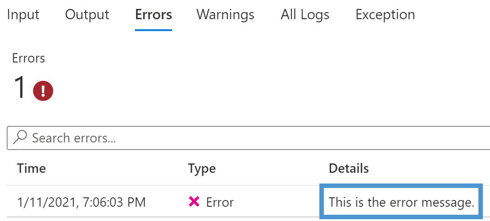
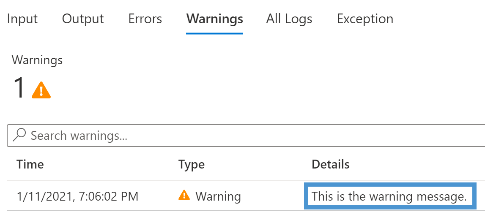
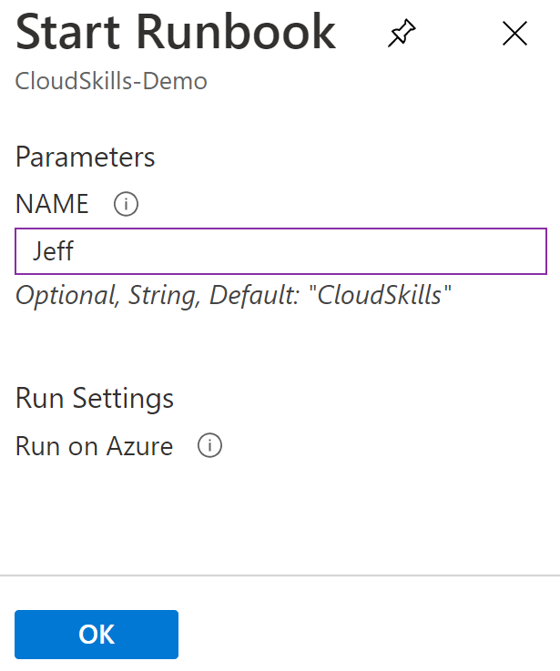

# Azure Automation: Creating a PowerShell Runbook

<!-- Use Title Case for all Titles -->

<!-- Learn about the title, introduction, and Goals sections at https://do.co/style#title-introduction-and-goals -->

<!-- Learn about formatting headers at https://do.co/style#headers -->

<!-- Our articles have a specific structure. Procedural tutorials follow this structure:

* Title
* Introduction (Level 3 heading)
* Prerequisites (Level 2 heading)
* Step 1 — Doing Something (Level 2 heading)
* Step 2 — Doing Something (Level 2 heading)
...
* Step 5 — Doing Something (Level 2 heading)
* Conclusion (Level 2 heading)


Learn more at https://do.co/style/structure -->

### Introduction

Azure Automation is a cloud-based automation and configuration service that can be

In this guide, you will set up your an Azure Automation Account and deploy your first PowerShell runbook. When you're finished, you will have the necessary skills to get started deploying runbooks in your Azure tenant.

## Prerequisites

Before you begin this guide you'll need the following:

- Azure tenant and subscription
- Administrator account with sufficient permissions on a subscription, such as Owner or Contributor
- PowerShell knowledge

## Create an Azure Automation Account

Before creating your first runbook, you need to create an Azure Automation Account. This account is responsible for executing runbooks and authenticating to any Azure resources the runbook needs access to. The account groups together Automation resources, runbooks, and configuration settings. You can create multiple accounts to separate their functionality, such as accounts for development and production.

To get started creating your first Azure Automation Account, log into the Azure portal at [https://portal.azure.com](https://portal.azure.com). In the Search bar, enter Azure Automation, and select Automation Accounts from the results.



Here in the Automation Accounts resource page, you can view and manage any existing Automation Accounts. Click on **+ Add** to create your Automation Account. In the **Add Automation Account** page, you need to define some information for your account:

- **Name**: Enter a description name for the account. Following Microsoft recommendations, I will name mine based on the resource type, its purpose, environment, Azure region, and instance. For example, aa-cloudskills-prod-westus-001.
- **Subscription**: Select a valid Azure subscription.
- **Resource Group**: Select an existing resource group or create a new one. For this demo, I am creating a new resource group named *azacct-rg*.
- **Location**: Select a location to host the Automation Account.
- **Create Azure Run As account**: Enabling this option will automatically create an Azure Run As account for authenticating to other Azure resources. For now, configure this to **Yes**.



Once the account information has been entered, click on **Create**. Once the account has been created successfully, select the account in the Automation Account list (this may require a refresh before it appears).

## Create the PowerShell Runbook

Now that they Automation Account has been created, you can create the runbook that hosts your PowerShell code. In the Automation Account resource using the left menu, scroll down to **Process Automation** and select **Runbooks**. Here you will see some example of each type of runbook you can create: Graphical, Python, and PowerShell. You can view each of these runbooks to learn how to perform different actions in runbooks, such as using variable or connecting to Azure resources. You can also import a runbook or browse the PowerShell Gallery and Azure Automation GitHub organization for resources created by Microsoft and the community.



Let's get started creating a runbook by select **+ Create a runbook**. In the form, enter a runbook name, select the runbook type, and enter a description. This demo will be using a PowerShell runbook type. Once the information has been entered, select the **Create** button.



When the runbook is created, the Azure portal should redirect you to the **Edit PowerShell Runbook** page. This page is where you can enter in the PowerShell code that the Automation Account executes. The menu actions include the ability to save the runbook, publish a new version of the runbook, revert to a previously published version, or run a test of the runbook. On the left, you can view the modules and cmdlets available to use in the runbook, import references to other runbooks, or view assets that you can use in the script, such as variables or certificates for authentication.



For this runbook, I am keeping the code simple and displaying the phrase "Hello, Azure Runbooks!" to the console.

```powershell
"Hello, Azure Runbooks!"
```

Once you have entered the code, select the **Save** button, then the **Publish** button. You will receive a warning that publishing the runbook will override the existing published version. Select **Yes** to this prompt. Once the runbook is successfully published, the Azure portal will redirect to the **Overview** page.

## Execute the Runbook

With the runbook created and published, you can now execute the runbook and view the output. From the **Overview** page, select the **Start** icon. It will prompt you to make sure you want to start the runbook, go ahead and select **Yes**. Once the runbook has been executed, the portal will redirect to the overview page for this runbook job instance. Here you can view the instance ID, the status, and the input and output streams of the runbook. From here, select the **Output** tab to view the "Hello, Azure Runbooks!" message to the console.



## Add Warning and Error Output

In the above example, the PowerShell runbook output the string "Hello, Azure Runbooks!". You can also use the cmdlets *Write-Warning* and *Write-Error* to output warning and error messages to the console logs.

Back on the runbook **Overview** page, select the Edit icon at the top to go back to the **Edit PowerShell Runbook* page with the existing code. In the code editor, add the following lines of code:

```powershell
Write-Warning -Message "This is the warning message."

Write-Error -Message "This is the error message."
```



Save and publish this version of the runbook. Back in the **Overview** page for the runbook, select the **Start** icon to execute the runbook again, just as you did previously. In the job results window, select the **Errors** and **Warnings** tabs to view the custom messages outputted from the script. You can also select **All Logs** to view all output from the script in one place.





By using the appropriate PowerShell cmdlets, you can create a runbook that shows regular, warning, and errors messages. Customzing this output can quickly show if the script is having any issues by properly displaying warnings and errors.

## Adding Parameters

PowerShell parameters enable passing information to a script to use during execution. Parameters enable PowerShell scripts to be more dynamic instead of setting static variables. Runbooks inside of Azure Automation can also use parameters when they are defined in the script. Let's examine this functionality now.

Follow the instructions from earlier in this post to edit the runbook code. In the code editor, add a parameter that will accept a name to display in the greeting message. If a parameter value is not given, the name will default to "CloudSkills". Here is the new runbook code.

```powershell
param (
    [Parameter()]
    [string]
    $Name = "CloudSkills"
)

"Hello, $Name"
```

After savining and publishing the runbook, execute the runbook just as you have done previously. However, this time Azure will display a **Start Runbook** page to allow you to input a value for the *Name* parameter. It also indicates that "CloudSkills" will be used as the default. Enter your name and select **OK**.



In the job results window, the **Input** tab will show the value of the *Name* parameter passed to the runbook, and the **Output** tab will show the output message using the value of the parameter.

## Using Variables

While you can define variables within the runbook code, you can also define variables within the Automation Account to be used by multiple runbooks.


<!-- For more information on steps, see https://do.co/style/#steps -->

Introduction to the step. What are we going to do and why are we doing it?

First....

Next...

Finally...

<!-- When showing a command, explain the command first by talking about what it does. Then show the command. Then show its output in a separate output block: -->

Display the status of your firewall with the following command:

```command
sudo ufw status
```

You'll see the following output:

```
[secondary_label Output]
Status: active

To                         Action      From
--                         ------      ----
OpenSSH                    ALLOW       Anywhere                  
<^>Nginx HTTP                 ALLOW       Anywhere<^>
OpenSSH (v6)               ALLOW       Anywhere (v6)             
<^>Nginx HTTP (v6)            ALLOW       Anywhere (v6)<^>
```

<!-- You can use highlighting in output to point out relevant details -->


<!-- When asking the reader to open a file, specify the file and show the command to open it: -->

Open the file `/etc/nginx.conf` in your editor:

```command
sudo nano /etc/nginx.com
```

<!-- When showing a configuration file, try to show only the relevant parts and explain what needs to change.  -->

Change the `root` field so it points to `/var/www/your_domain`:

```nginx
[label /etc/nginx/sites-available/default]
server {
    listen 80 default_server;
    listen [::]:80 default_server ipv6only=on;

    root <^>/var/www/your_domain<^>;
    index index.html index.htm;

    server_name localhost;

    location / {
        try_files $uri $uri/ =404;
    }
}
```

<!-- See do.co/style#commands-and-code-in-steps for more on how to incorporate command and code in your steps. -->

Now transition to the next step by telling the reader what's next.

## Step 2 — Title Case

Another introduction

Your content

Transition to the next step.

## Step 3 — Title Case

Another introduction

Your content

Transition to the next step.

## Conclusion

In this article you [configured/set up/built/deployed] [something]. Now you can....

<!-- Speak  to reader benefits of this technique or procedure and optionally provide places for further exploration. -->


<!------------ Formatting ------------------------->

<!-- Some examples of how to mark up various things

This is _italics_ and this is **bold**.

Only use italics and bold for specific things. Learn more at https://do.co/style#bold-and-italics

This is `inline code`. Use it for referencing package names and commands.

Here's a command someone types in the Terminal:

```command
sudo nano /etc/nginx/sites-available/default
```

Here's a configuration file. 

The label on the first line lets you clearly state the file that's being shown or modified:

```nginx
[label /etc/nginx/sites-available/default]
server {
    listen 80 default_server;
    listen [::]:80 default_server ipv6only=on;

    root <^>/usr/share/nginx/html<^>;
    index index.html index.htm;

    server_name localhost;

    location / {
        try_files $uri $uri/ =404;
    }
}
```

Here's output from a command:

```
[secondary_label Output]
Could not connect to Redis at 127.0.0.1:6379: Connection refused
```

Learn about formatting commands and terminal output at https://do.co/style#code

Key presses should be written in ALLCAPS with in-line code formatting: `ENTER`.

Use a plus symbol (+) if keys need to be pressed simultaneously: `CTRL+C`.

This is a <^>variable<^>.

This is an `<^>in-line code variable<^>`

Learn more about how to use variables to highlight important items at https://do.co/style#variables

Use `<^>your_server_ip<^>` when referencing the IP of the server.  Use `111.111.111.111` and `222.222.222.222` if you need other IP addresses in examples.

Learn more about host names and domains at https://do.co/style#users-hostnames-and-domains

<$>[note]
**Note:** This is a note.
<$>

<$>[warning]
**Warning:** This is a warning.
<$>

Learn more about notes at https://do.co/style#notes-and-warnings

Screenshots should be in PNG format and hosted on imgur. Embed them in the article using the following format:


Learn more about images at https://do.co/style#images-and-other-assets
-->