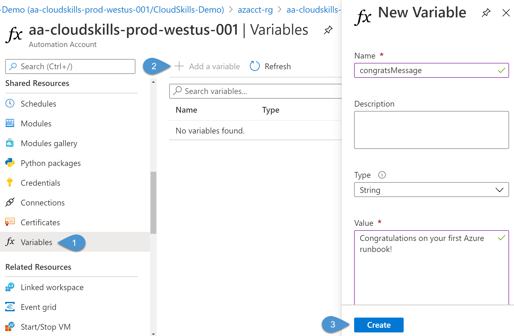
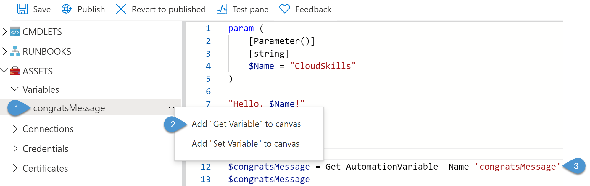
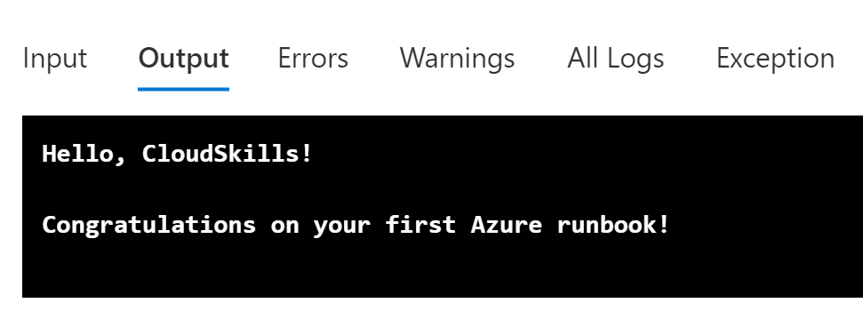

# Azure Automation: Creating a PowerShell Runbook

Azure Automation is a cloud-based automation and configuration service that you can use for process automation through runbooks. You can author runbooks using a graphical interface or in PowerShell or Python programming languages. Think of these runbooks as replacing scripts you have scheduled to run on a server. 

In this guide, you will set up an Azure Automation Account and deploy your first PowerShell runbook. When you're finished, you will have the necessary skills to get started deploying runbooks in your Azure tenant.

## Prerequisites

Before you begin this guide, you'll need the following:

- Azure tenant and subscription
- Administrator account with sufficient permissions on a subscription, such as Owner or Contributor
- PowerShell knowledge

## Create an Azure Automation Account

Before creating your first runbook, you need to create an Azure Automation Account. This account is responsible for executing runbooks and authenticating to Azure resources required by the runbook. The account groups together Automation resources, runbooks, and configuration settings. You can create multiple accounts to separate their functionality, such as accounts for development and production.

To get started creating your first Azure Automation Account, log into the Azure portal at [https://portal.azure.com](https://portal.azure.com). In the Search bar, enter Azure Automation, and select Automation Accounts from the results.


Here on the Automation Accounts resource page, you can view and manage any existing Automation Accounts. Click on **+ Add** to create your Automation Account. In the **Add Automation Account** page, you need to define some information for your account:

- **Name**: Enter a descriptive name for the account. Following Microsoft recommendations, I will name mine based on the resource type, its purpose, environment, Azure region, and instance. For example, aa-cloudskills-prod-westus-001.
- **Subscription**: Select a valid Azure subscription.
- **Resource Group**: Select an existing resource group or create a new one. For this demo, I am creating a new resource group named *azacct-rg*.
- **Location**: Select a location to host the Automation Account.
- **Create Azure Run As account**: Enabling this option will automatically create an Azure Run As account for authenticating to other Azure resources. For now, configure this to **Yes**.


Once you have entered the account information, click on **Create**. Once Azure creates the account successfully, select the account in the Automation Account list (this may require a refresh before it appears).

## Create a PowerShell Runbook

Now that the Automation Account has been created, you can author the runbook that hosts your PowerShell code. Using the left menu in the Automation Account resource, scroll down to **Process Automation** and select **Runbooks**. Here you will see some examples of each type of runbook you can create: Graphical, Python, and PowerShell. You can view each of these runbooks to learn how to perform different actions in runbooks, such as using variables or connecting to Azure resources. You can also import a runbook or browse the PowerShell Gallery and Azure Automation GitHub organization for resources created by Microsoft and the community.


Let's get started creating a runbook by selecting **Create a runbook**. In the form, enter a runbook name, select the runbook type, and enter a description. This demo is using a PowerShell runbook type. Once you have entered all the runbook information, select the **Create** button.


After Azure creates the runbook, it should redirect you to the **Edit PowerShell Runbook** page. This page is where you can enter in the PowerShell code that the Automation Account executes. The menu actions include the ability to save the runbook, publish a new version of the runbook, revert to a previously published version, or run a test of the runbook. On the left, you can view the modules and cmdlets available to use in the runbook, import references to other runbooks, or view assets that you can use in the script, such as variables or certificates for authentication.


For this runbook, I am keeping the code simple and displaying the phrase "Hello, Azure Runbooks!" to the console.

```powershell
"Hello, Azure Runbooks!"
```

Once you have entered the code, select the **Save** button, then the **Publish** button. You will receive a warning that publishing the runbook will override the existing published version. Select **Yes** to this prompt. Once the runbook is successfully published, the Azure portal will redirect to the **Overview** page.

## Execute the Runbook

With the runbook created and published, you can now execute the runbook and view the output. From the **Overview** page, select the **Start** icon. It will prompt you to make sure you want to start the runbook, go ahead and select **Yes**. Once Azure begins executing the runbook, the portal will redirect to the overview page for this runbook job instance. Here, you can view the instance ID, the status, and the input and output streams of the runbook. From here, select the **Output** tab to view the "Hello, Azure Runbooks!" message to the console.


## Add Warning and Error Output

In the above example, the PowerShell runbook output the string "Hello, Azure Runbooks!". You can also use the cmdlets *Write-Warning* and *Write-Error* to output warning and error messages to the console logs.

Back on the runbook **Overview** page, select the Edit icon at the top to go back to the **Edit PowerShell Runbook** page with the existing code. In the code editor, add the following lines of code:

```powershell
Write-Warning -Message "This is the warning message."

Write-Error -Message "This is the error message."
```


Save and publish this version of the runbook. Back in the **Overview** page for the runbook, select the **Start** icon to execute the runbook again, just as you did previously. In the job results window, select the **Errors** and **Warnings** tabs to view the custom messages outputted from the script. You can also select **All Logs** to view all output from the script in one place.


Using the appropriate PowerShell cmdlets, you can create a runbook that shows regular, warning, and error messages. Customizing this output can quickly ascertain if the script has any issues by correctly displaying warnings and errors.

## Enhance Runbook Execution with Parameters

PowerShell parameters enable passing information to a script to use during execution. Parameters allow PowerShell scripts to be more dynamic instead of setting static variables. Azure Automation PowerShell runbooks can also use parameters when you define them in the script code. Let's examine this functionality now.

Follow the instructions from earlier in this post to edit the runbook code. In the code editor, add a parameter that will accept a name to display in the greeting message. Since this parameter is not mandatory, I'm defining the parameter with a default value of "CloudSkills." Here is the new runbook code.

```powershell
param (
    [Parameter()]
    [string]
    $Name = "CloudSkills"
)

"Hello, $Name"
```

After saving and publishing the runbook, execute the runbook just as you have done previously. However, this time Azure will display a **Start Runbook** window to allow you to input a value for the *Name* parameter. It also indicates that "CloudSkills" will be used as the default if you don't enter another value. Enter your name and select **OK**.


In the job results window, the **Input** tab will show the value of the *Name* parameter passed to the runbook, and the **Output** tab will show the output message using the value of the parameter.

## Creating a Variable Asset

While you can define variables within the runbook code, you can also define variables within the Automation Account to be used by multiple runbooks. Back in the Automation Account, navigate to **Shared Resources** > **Variables**. From here, select **Add a variable**. In the **New Variable** window, enter a variable name, description, data type, value, and encryption type. Once completed, select **Create**.



With the variable create, you can now reference it in a runbook. Navigate back to the runbook and edit the code. Inside the script, you can retrieve the variable's value by using the **Get-AutomationVariable** with the variable name and storing it into a script-level variable.

```powershell
$congratsMessage = Get-AutomationVariable -Name 'congratsMessage'
```

You can now use the defined variable as needed in the script. Suppose you don't remember the name of the variable asset you defined in the Automation Account. In that case, you can view variable assets under **Assets** and use the context menu to auto-generate the PowerShell command.



Save, publish, and then execute the runbook to verify the variable output in the job results window.



## Conclusion

In this post, you learned how to create an Azure Automation Account to host your first PowerShell runbook. You saw how to view the runbook output and use *Write-Warning* and *Write-Error* to customize the output. Finally, you extended the functionality of your runbook with parameters and variable assets.

Check back soon for my next post on Azure Automation where I will show how to configure authentication to access and manage Azure resources.