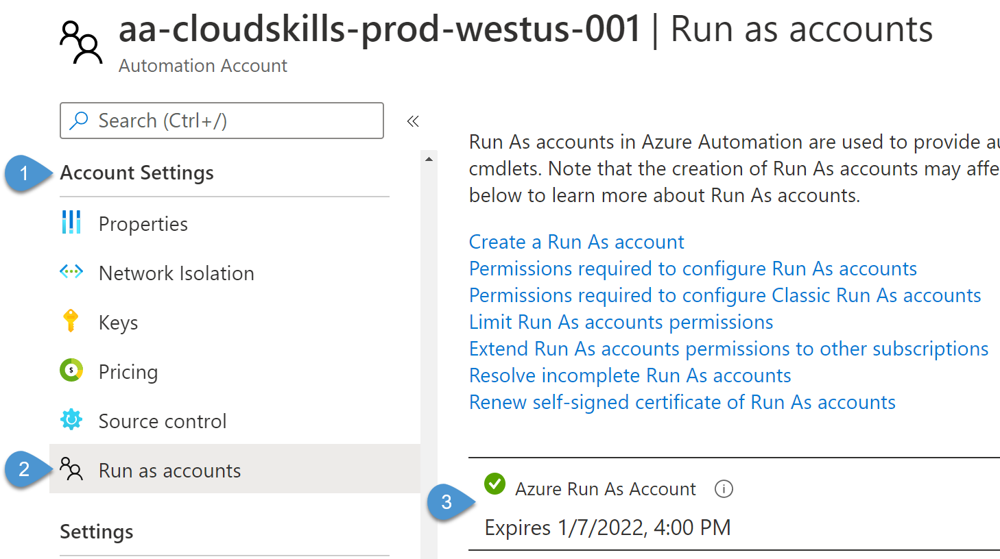
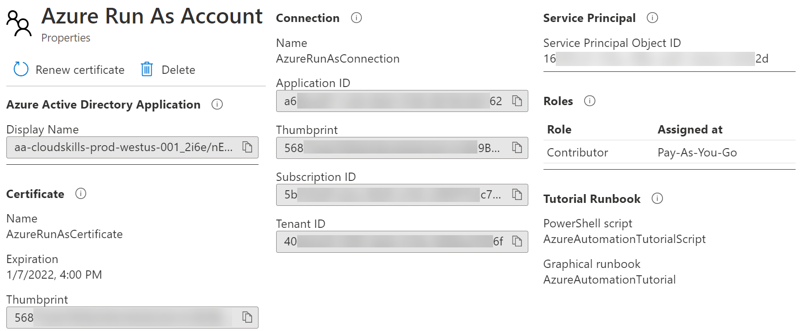
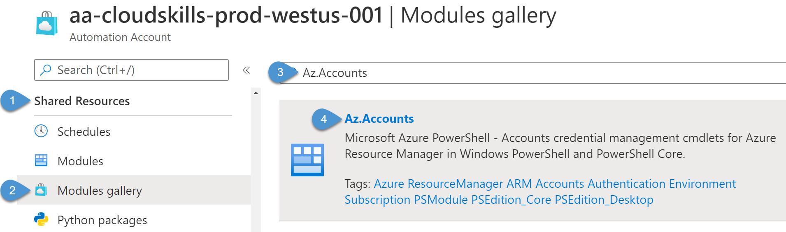
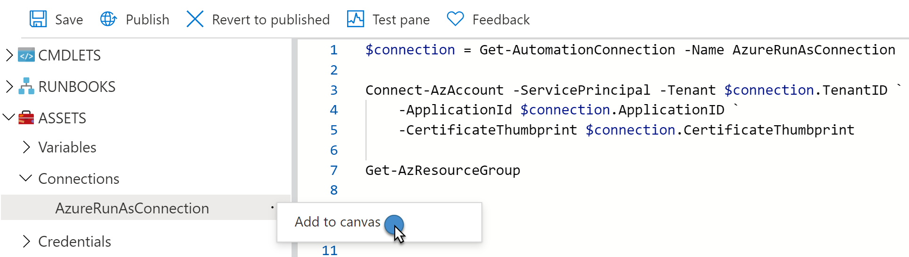
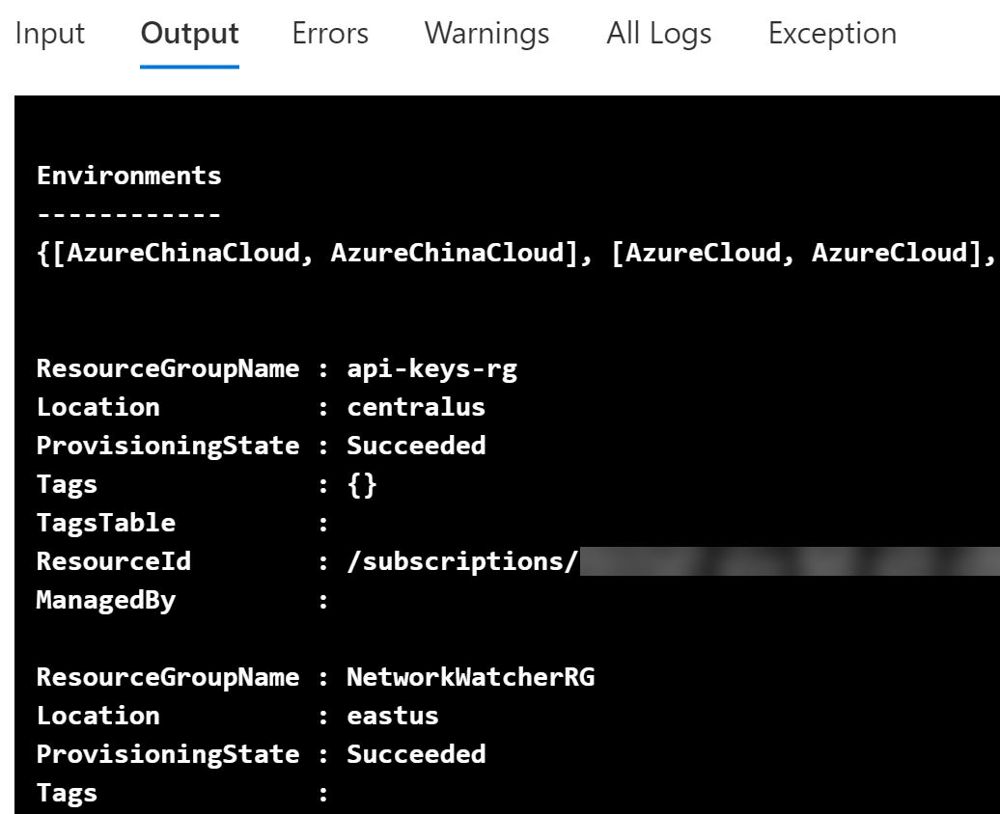
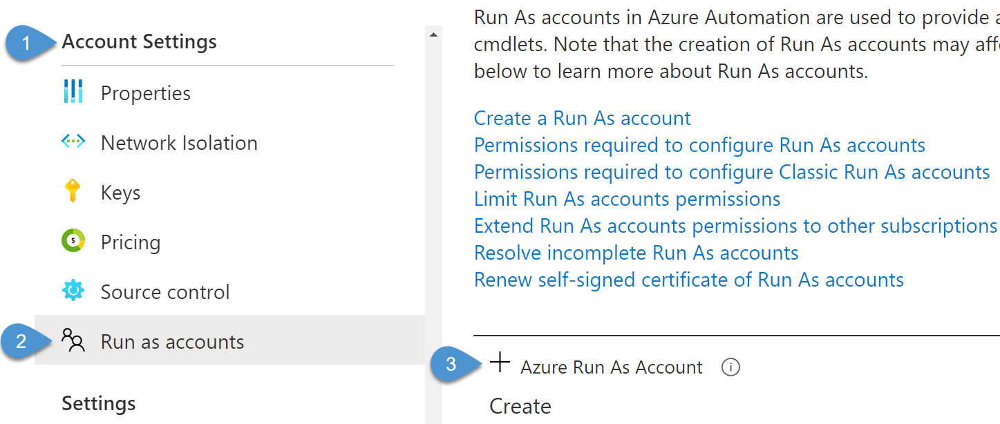

# Azure Automation: Managing Runbook Authentication and Modules

In my previous post, we took a look at [creating your first Azure Automation PowerShell runbook](https://cloudskills.io/blog/azure-automation-runbook). We set up the Azure Automation account, authored a PowerShell runbook, and incorporated parameters and variable assets. The next step is to understand how we can access and manage other Azure resources from our runbooks.

In this guide, you will learn about how Azure Automation can authenticate and access Azure resources. We will also take a look at importing more modules to add cmdlets to our runbooks. When you're finished, you'll have the skills to elevate your runbooks to the next level.

## Prerequisites

Before you begin this guide, you'll need the following:

- Azure tenant and subscription
- Administrator account with sufficient permissions on a subscription, such as Owner, or a role containing Microsoft.Automation resource authorization
- PowerShell knowledge

## Azure Automation Run As Account

When I created the Azure Automation account in the first article, I enabled the option [to create an Azure Run As account](https://cloudskills.io/blog/azure-automation-runbook#create-an-azure-automation-account). By enabling this option, Azure will automatically create an Azure AD application. You can use this application identity to authenticate to an Azure subscription to access and manage resources. Azure performs several other functions such as:

- Adding a self-signed certificate to the application account.
- Creating a service principal identity for the application.
- Assigning the **Contributor** role for the account in the current subscription.
- Creating Automation connection assets named **AzureRunAsCertificate** and **AzureRunAsConnection**.

If you want to view more information about the Run As account, from the Automation Account resource page, navigate to **Account Settings > Run as accounts**.



You can view the account's properties in the portal, including the certificate thumbprint, the Azure AD application information, service principal ID, role assignments, and runbooks utilizing the account.



At the top of the properties page, note an action named **Renew Certificate**. The account's certificate is only valid for one year, so be sure to renew before expiration to keep your runbooks from failing.

Along with the Run As account, Azure will create two connection assets: **AzureRunAsCertificate** and **AzureRunAsConnection**. The certificate asset authenticates to Azure so the runbook can manage Azure Resource Manager resources. As noted above, the certificate has a one-year lifespan. The connection asset contains the application ID, tenant ID, subscription ID, and certificate thumbprint. Basically, everything you need to connect to Azure to start managing resources! In an upcoming example, I'll use this connection to connect to Azure and to retrieve some resources.

## Automation Account Modules

Before I create a new runbook to manage my Azure resources, I need to make sure I have the right PowerShell commands available. When you create a new Automation Account, Azure will automatically import some PowerShell modules for you, such as AzureRM.Automation, AzureRM.Computer, and AzureRM.Resources. However, these modules are a part of the older AzureRM PowerShell module, which Microsoft is no longer developing. Microsoft has replaced this module with the newer Az PowerShell module.

Luckily, I'm not stuck using the older modules in my PowerShell runbooks. I can import the new Az modules into the Automation Account for use with my PowerShell code. From the Automation Account, navigate to **Shared Resources > Modules gallery**. The first module I need to import is the *Az.Accounts* module so I can use the *Connect-AzAccount* cmdlet in my runbook. Search for "Az.Accounts", then select the resulting module.



From the module page, I can search the module for the cmdlets and functions to verify it has what I need. From here, I can select the **Import** action at the top. Once the import is successful, I need to navigate the **Modules gallery** and perform the same steps for the *Az.Resources* module so I can use the *Get-AzResourceGroup* in my runbook.

The imports can take a few minutes, but you can verify the status by navigating back to **Shared Resources > Modules**. In this list of modules, verify the module import progress in the **Status** column.

From this **Modules** page, also note there are options to import a custom module. Select the **+ Add a module** and select a .zip file that contains the module code. Note that the module code's file name must match the file name of the zip file. Importing custom written module is a fantastic feature of Azure Automation that allows you to write a runbook to fit any scenario.

## Connect to Azure from PowerShell Runbook

Back in the Automation Account, I will create a new runbook that will connect to Azure and retrieve my resource groups. In the Automation Account, navigate to **Process Automation > Runbooks**, then select **+ Create a runbook**. From here, input a name for the runbook, select the PowerShell runbook type, then select **Create**.

In the **Edit PowerShell Runbook** window, I need to write code that will retrieve the information stored in **AzureRunAsConnection**. For this, I can use the command *Get-AutomationConnection* and specify the name of the Run As connection. If I store the connection information to a variable, I can reference the tenant ID, application ID, and certificate thumbprint in the *Connect-AzAccount* cmdlet to authenticate to my Azure tenant.


```powershell
$connection = Get-AutomationConnection -Name AzureRunAsConnection

Connect-AzAccount -ServicePrincipal `
    -Tenant $connection.TenantID `
    -ApplicationId $connection.ApplicationID `
    -CertificateThumbprint $connection.CertificateThumbprint
```

Once the runbook connects, I can now use other Az cmdlets to work with Azure resources. Since I imported the *Az.Resources* module, I can retrieve all my resource groups using the *Get-AzResourceGroup* cmdlet. If you do not remember the cmdlet to retrieve the Run As connection asset, remember you can expand *Assets* on the left to view saved connections and other assets. Selecting *Add to canvas* will insert the necessary PowerShell code.



From here, I will save the runbook code, publish, and then execute it. When I view the runbook job status, the **Output** tab will show the runbook successfully authenticating to Azure. It will then start displaying my resource groups.



Retrieving resource groups is only the beginning of what is possible. Imagine what other tasks you could automate within a runbook, such as taking snapshots of virtual machine disks, turning off virtual machines, or automatically resizing resources based on a schedule.

## Managing Runbook Authentication without Run As Accounts

You might be asking, "If I don't create a Run As account with the Automation Account, how can I authenticate to Azure?". There are a few options for managing authentication in this scenario, which I outline in the following sections. Remember, if you choose not to use the built-in Run As account, you will need to ensure that whichever account used has permissions to the Azure resources the script is trying to access. The built-in Run As account accomplishes this by being a Contributor at the subscription level, but you may want to apply more granular permissions.

### Create the Run As Account

I can still enable the Run As account after the Automation Account has been created. In the account, navigate to **Account Settings > Run as accounts**. Previously in this screen, we viewed the existing account, but I can also create one if it doesn't exist already. No additional inputs or settings are needed to set up the account.



### Create a Service Principal

Applications use a service principal to access resources secured by Azure AD. The service principle represents the application inside the tenant, and you can assign it permissions to resources (just like a user account).

To create a service principal, navigate to Azure Active Directory in the Azure portal. In the **Manage** section, select **App registrations**. Select **+ New registration**, then input the application's name, support account type (for now, leave at the default), and redirect URI (this can be blank).

After you create the app registration, on the **Overview** page, take note of the application ID and tenant ID. You will need this information later to create a new connection or credentials asset (see following sections). In the **Manage** section, you can navigate to **Certificates & secrets** to upload a certificate or generate a secret. You can then use either of these to authenticate out to Azure.

### Create a New Connection Asset

You can create your own connection asset that includes an ApplicationId, TenantId, Certificate Thumbprint, and Subscription Id. If you created a service principal in the previous section, you could use it for this purpose.

Create a connection asset in the Automation Account by navigating to **Shared Resources > Connections**, then select **+ Add a connection**. Give a name to the connection asset, select *AzureServicePrincipal* as the type, and enter the required information from the service principal. Once the connection is created, I can use it just like the *AzureRunAsConnection* asset in my PowerShell code from earlier.

### Create a Credentials Asset

Finally, you can store security credentials as a shared resource. The credentials asset includes a username and password, and you can use these on cmdlets that accept a PSCredential object. In the Automation Account, navigate to **Shared Resources > Credentials** and select **+ Add a credential**. Name the credential and enter the username and password.

Once you create the asset, you can retrieve the credentials using *Get-AutomationPSCredential* and store them in a variable. You then pass the credentials to the **Connect-AzAccount** cmdlet, like so:

```PowerShell
$creds = Get-AutomationPSCredential -Name '{CredentialAssetName}'

Connect-AzAccount -Credentials $creds
```

Don't forget, you can use the Asset explorer on the left to input the correct code and asset name into your script.

## Conclusion

In this post, you learned how to configure authentication so your runbooks can access Azure resources. Being able to authenticate to Azure without storing usernames and passwords in the runbook code is a security best practice. Now that you can connect to Azure, start thinking about what tasks you can automate using runbooks. You will need to be sure to import any modules required by your code.

Check back soon for my next post on Azure Automation where I will show how to configure a hybrid worker so you can execute a runbook anywhere.