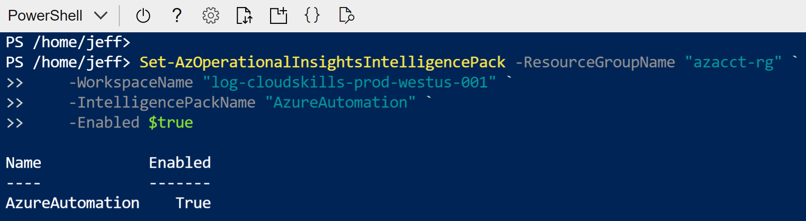
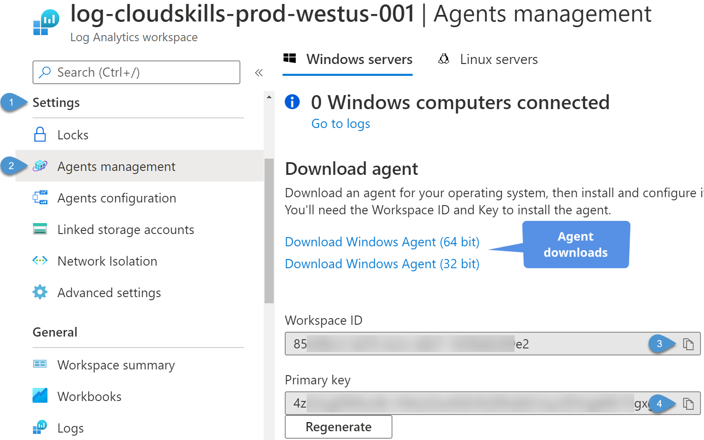
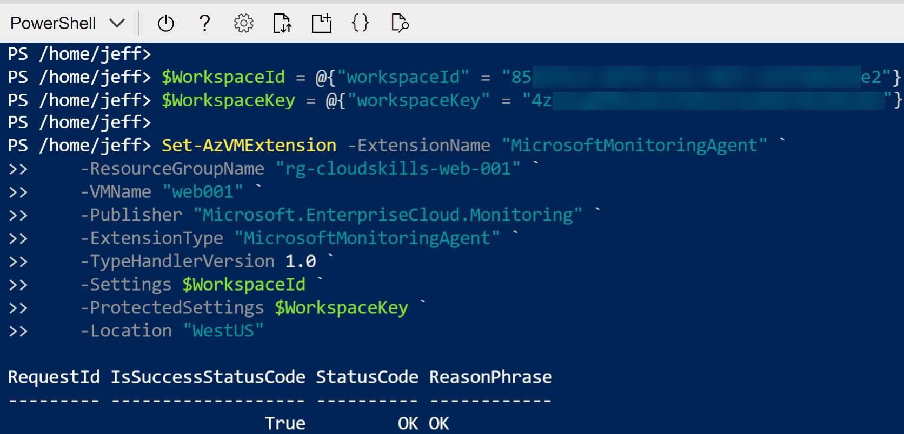
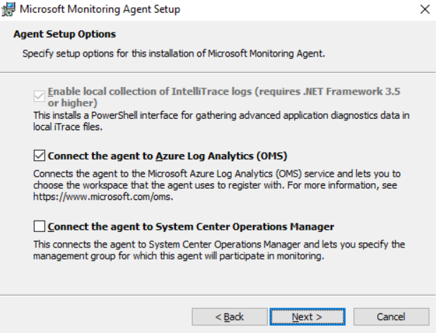
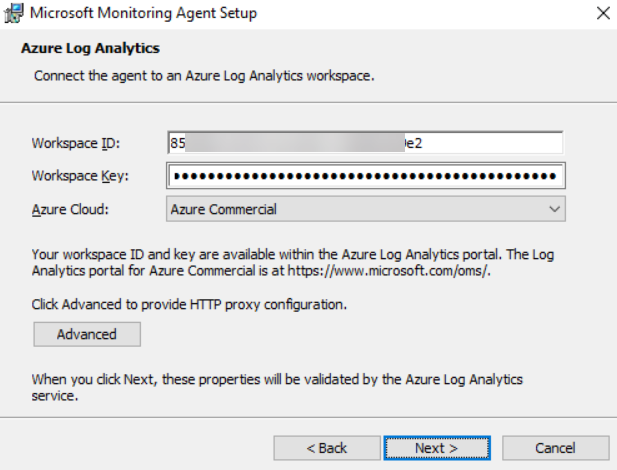
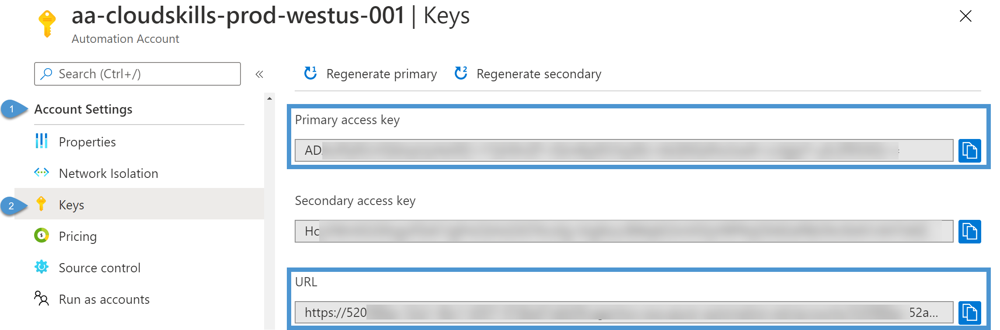
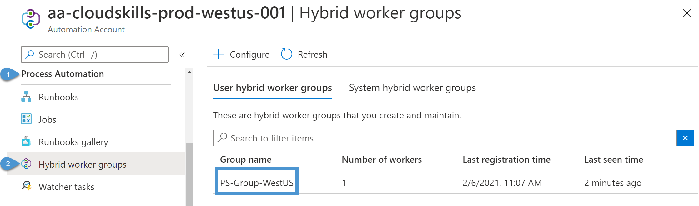
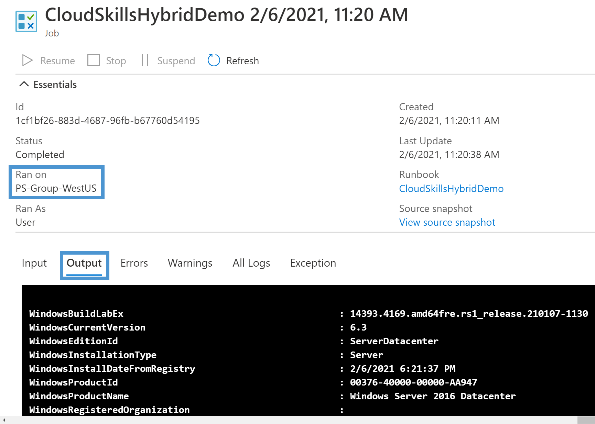
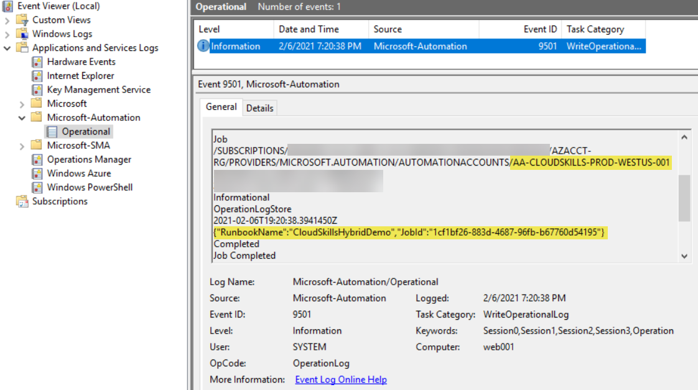

# Azure Automation: Configuring Hybrid Worker Groups

In previous posts, you learned [how to create your first Azure Automation PowerShell runbook](https://cloudskills.io/blog/azure-automation-runbook) and [how to configure authentication to Azure resources](https://cloudskills.io). With these tools available, your next step is to expand your runbook's reach outside of Azure to on-premises resources. Azure Automation makes this possible with Hybrid Worker Groups.

In this guide, you will learn how to deploy a Hybrid Worker capable of executing an Azure cloud runbook to system of your choosing.

## Prerequisites

Before you begin this guide, you'll need the following:

- Azure tenant and subscription
- Administrator account with sufficient permissions on a subscription, such as Owner or a role containing Microsoft.Automation resource authorization
- Server to configure as a Hybrid Worker, such as an Azure virtual machine or on-premises server. This guide is using Window Server 2016.

## Reasons to Use a Hybrid Worker

Hybrid Workers execute runbooks on a system outside of Azure's sandbox. The system can be another Azure virtual machine or inside your datacenter. This configuration allows runbooks to bypass [Azure Automation's limits and quotas on using resources](https://docs.microsoft.com/en-us/azure/azure-resource-manager/management/azure-subscription-service-limits#automation-limits). Examples of Azure's sandbox limitations include:

- Maximum 1 GB of disk space
- Maximum 400 MB of memory
- Maximum runtime of 3 hours per runbook execution

Using a hybrid worker allows you to bypass these limitations as the runbook can use all the resources available on the Hybrid Worker. If you have a long-running script, using a hybrid worker avoids Azure's 3-hour max runtime. You also use a Hybrid Worker to interact with on-premises resources or integrate with third-party tools not available in Azure.

## How Hybrid Workers Execute

You can deploy multiple Hybrid Workers into Hybrid Worker Groups. Azure Automation can execute runbooks on any of the workers in the group. The Hybrid Worker system uses the Microsoft Monitoring Agent installed on the system to manage runbook execution. The agent polls the Automation Account every 30 seconds over an outbound TCP 443 connection for tasks to execute. Each system can host one Hybrid Worker that connects to one Automation Account. You cannot register the Hybrid Worker across multiple Automation Accounts. The runbook uses the local **System** account on a Windows system, and on Linux, the runbook uses the **nxautomation** account.

When developing a runbook (either PowerShell or Python), you should write the code on the Hybrid Worker system. When you write the code on the system, you are verifying the runbook's successful execution on the local system. Once the code is complete, upload the code to the Azure Automation Account using the Azure portal. If your runbook requires additional PowerShell modules, install the module using the *Install-Module* cmdlet with the parameter *-Scope AllUsers*. The *AllUsers* scope enables the local runbook account to use the module in its code.

```
Install-Module -Name "{Module Name}" -Scope AllUsers
```

## Authenticating with Hybrid Runbooks

Since Azure Automation executes the runbook outside the Azure sandbox, you cannot easily use the [built-in RunAs account](https://cloudskills.io/blog/azure-automation-runbook-2#azure-automation-run-as-account). To use the account, you would need to export the Run As certificate and import it to each hybrid worker. When it comes time to renew the certificate, you would need to import it again.

Instead, you can create a credential asset with stored usernames and passwords. You store the assets using the following formats:

- domain\username
- username@domain
- username (for local accounts on the hybrid worker)

Retrieve the credential asset using the *Get-AutomationPSCredential* cmdlet and store it in a variable. You use the new variable to authenticate to local resources, for example, restarting a remote system, like this:

```
$creds = Get-AutomationPSCredential -Name "{Credential Asset}"
Restart-Computer -ComputerName "{Name of Remote System}" -Credential $creds
```

## Configure Log Analytics Workspace

Azure Automation requires a Log Analytics Workspace to configure a Hybrid Worker. If you don't have an existing Log Analytics workspace available, follow this article [Create a Log Analytics workspace in the Azure portal](https://docs.microsoft.com/en-us/azure/azure-monitor/learn/quick-create-workspace). You create the log analytics workspace in the same Azure region as the Automation Account; otherwise, you cannot associate the two.

With the Automation Account and Log Analytics workspace deployed to the same region, you need to connect the two resources. In the Automation Account, navigate to **Configuration Management > Inventory**. Choose the Log Analytics workspace subscription and Log Analytics workspace from the dropdown menus. If no Log Analytics workspaces are available, double-check it is in the same region as the Automation Account. Once configured, select **Enable**.


Next, you enable the Azure Automation solution in the Log Analytics workspace. You need the Log Analytics workspace's resource group name and the Log Analytic's workspace name. Open an instance of the Azure Shell, or use *Connect-AzAccount* from a PowerShell console, and run the *Set-AzOperationalInsightsIntelligencePack* command.

```
Set-AzOperationalInsightsIntelligencePack -ResourceGroupName "{Name}"  `
    -WorkspaceName "{Workspace Name}" `
    -IntelligencePackName "AzureAutomation" `
    -Enabled $true
```



### Gather Log Analytics Workspace Information

Before installing the Microsoft Monitoring Agent on the hybrid worker, you need to document a few things from the Log Analytics workspace. From the Log Analytics workspace, navigate to **Settings > Agents management**. In this window are two tabs, one for Windows servers and one for Linux servers. This tutorial is using Windows servers. If you are installing the agent to an on-premises server, download the appropriate installer version for your server (32 or 64-bit).

Next, copy the **Workspace ID** and the **Primary key** for authentication. You need these when installing the monitoring agent extension for an Azure virtual machine. Note that there are two keys available for use. You can switch the agent to use the secondary key while before regenerating the primary key. This key rotation strategy ensures the hybrid worker does not fail to execute the runbooks.



## Deploying the Monitoring Agent

With Log Analytics deployed and connected to the Automation Account, it is time to configure a hybrid worker. The steps to configure both an Azure virtual machine and an on-premises server are almost identical. The only difference is the agent's installation method, and I will cover both ways to complete this task.

### Deploy Extension to Azure Virtual Machine

For an Azure virtual machine, you use PowerShell to add the Monitoring Agent extension to the virtual machine. You need the Log Analytics workspace ID and key documented previously, as well as the resource group name hosting the virtual machine, the virtual machine name, and the Azure region. Again, use the Azure Shell or use *Connect-AzAccount* from a separate console to connect to your Azure subscription.

First, save the workspace ID and key to separate hashtables.

```
$WorkspaceId = @{"workspaceId" = "{Workspace Id}"}
$WorkspaceKey = @{"workspaceKey" = "{Workspace Key}"}
```

Next, use the *Set-AzVMExtension* to enable the agent and configure it to point to the Log Analytics workspace.

```
Set-AzVMExtension -ExtensionName "MicrosoftMonitoringAgent" `
    -ResourceGroupName "{Resource Group Name}" `
    -VMName "{Virtual Machine Name}" `
    -Publisher "Microsoft.EnterpriseCloud.Monitoring" `
    -ExtensionType "MicrosoftMonitoringAgent" `
    -TypeHandlerVersion 1.0 `
    -Settings $WorkspaceId `
    -ProtectedSettings $WorkspaceKey `
    -Location "{Virtual Machine Azure Region}"
```

Here is the command in action for my virtual machine *web001* in the resource group *rg-cloudskills-web-001* located in the *WestUS*.




### Install Agent to Server
If you are installing to an on-premises or non-Azure virtual machine, you manually install the Microsoft Monitoring Agent. Save the installer from the Log Analytic's agent management screen from earlier to the local system and run the executable. In the wizard start page, select **Next**, agree to the license terms and select the default installation location. For the agent setup options, select **Connect the agent to Azure Log Analytics (OMS)**. Click **Next**.



On the next screen, enter the workspace ID and key for the Log Analytics workspace. Select the appropriate Azure cloud instance and configure an HTTP proxy if needed. Click **Next**.



Choose the recommended update option and click **Next**. Finally, click the **Install** button. The agent will complete its installation and prompt for a reboot if required.

## Configuring the Hybrid Worker

Before configuring the system as a Hybrid Worker, you need a few more pieces of information. Back in the Automation Account, navigate to **Account Settings > Keys**. Document the account's URL and either a primary or secondary key. You need the URL and a key so the Hybrid Worker can authenticate and retrieve Automation Account jobs.



With the agent installed and Automation Account information documented, you now configure the system as a Hybrid Worker. On the server, open a PowerShell console and navigate to the following directory, replacing *{version}* with the current version of the agent. If you do not find the *AzureAutomation* folder, ensure you enabled the Azure Automation solution in the Log Analytics workspace from earlier.

```
C:\Program Files\Microsoft Monitoring Agent\Agent\AzureAutomation\{version}\HybridRegistration
```

Import the Hybrid Worker Registration PowerShell module using the *Import-Module* command and specifying the *HybridRegistration.psd1* module:

```
Import-Module -Name HybridRegistration.psd1
```

With the module imported, run the *Add-HybridRunbookWorker* command specifying the Hybrid Worker Group name and the Automation Account's URL and key. If this is the first Hybrid Worker in a group, you name the group whatever you like, and the command will create the group for you.

```
Add-HybridRunbookWorker –GroupName "{Group Worker Name}" -Url "{Automation Account URL}" -Key "{Automation Account Access Key}"
```

To verify the deployment, in the Automation Account, navigate to **Process Automation > Hybrid worker groups**. Here you find the group name specified from the PowerShell command. If you select the group name and navigate to **Hybrid worker groups > Hybrid workers**, you will find the systems that make up the group.



## Execute Runbook on Hybrid Worker

With all the pieces in place, it is time to execute a runbook from the Hybrid Worker. For this tutorial, I created a PowerShell runbook that executes *Get-ComputerInfo* to verify the runbook is running on the Hybrid Worker system. If you need a refresher on creating a PowerShell runbook, see the [first article in this series here on CloudSkills.io blog](https://cloudskills.io/blog/azure-automation-runbook).

When you start the runbook, Azure will prompt for the run settings, which includes the option to execute the runbook in the Azure sandbox environment or on a Hybrid Worker. Select the toggle for Hybrid Worker and choose the Hybrid Worker Group from the dropdown menu. Click **OK**.


In the runbook execution page, select the **Output** tab to view the PowerShell command output, which is displaying the result of *Get-ComputerInfo*.



You can monitor Automation Account runbook execution by opening Event Viewer and navigating to **Applications and Services Log > Microsoft-Automation > Operational**. The runbook will log each time it runs and include information about which Automation Account and runbook is executed.



## Conclusion

With Hybrid Worker Groups, you extend the runbook's functionality by moving outside the Azure sandbox environment. Hybrid Worker Groups enable you to execute time-intensive runbooks and access resources not available from Azure. With Azure Automation, you no longer need to schedule tasks to run on individual servers, and Hybrid Workers enable you to group multiple servers together for executing runbooks. Thank you for reading and good luck in your Azure Automation deployment!