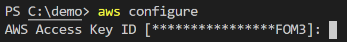
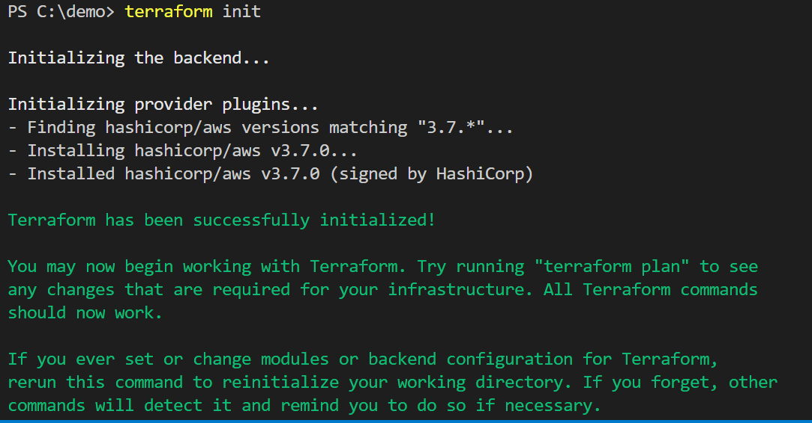
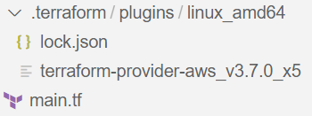
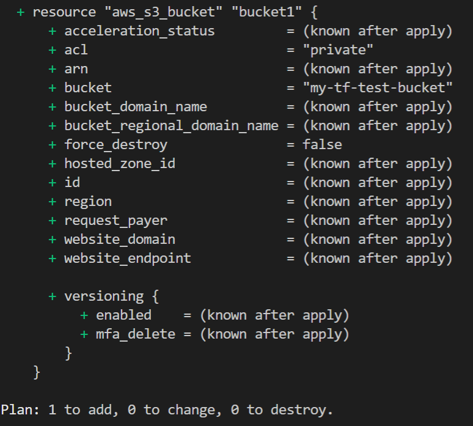
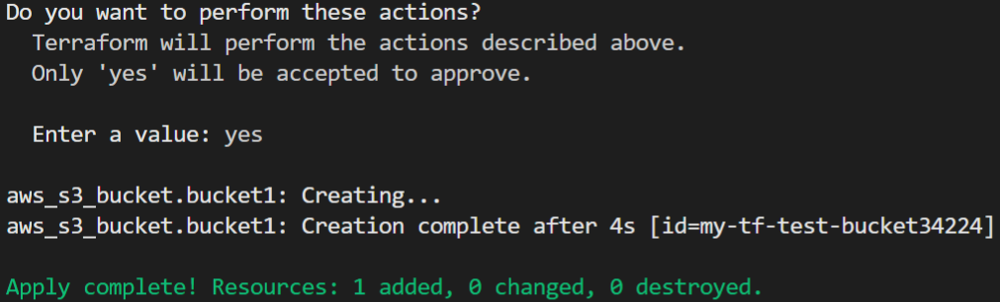
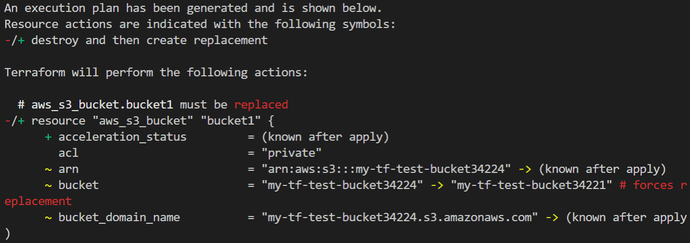
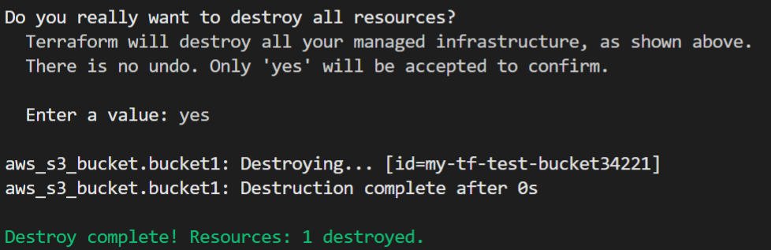

# Getting Started with Terraform on AWS: Deploying Resources
Terraform is rapidly changing the game for many companies. It's an infrastructure automation tool that allows users to manage infrastructure and systems through code. One of Terraform's big strengths is that it's platform-agnostic, meaning it can be used to manage different cloud infrastructure and vSphere on-premises environments. It also requires minimal coding experience to use, which makes it easy for teams to adopt.

Over the years, the [State of DevOps report](https://services.google.com/fh/files/misc/state-of-devops-2019.pdf) has proven that companies that are managing their infrastructure through code are moving faster than those who are using the traditional methods. They are scaling faster, failing less, and becoming more resilient with automated recovery solutions in place. Terraform allows companies to adopt this strategy, which is why it is becoming one of the most favored DevOps tools.

Terraform communicates with the API of each system it manages using *providers*. There are now [over 150 official providers available](https://www.terraform.io/docs/providers/index.html#lists-of-terraform-providers). There are also [community providers](https://www.terraform.io/docs/providers/type/community-index.html) developed by the community and not officially managed by Hashicorp. A custom provider can be made for any system with a solid API and managed by Terraform. 

In this guide, you will use Terraform to deploy resources to AWS.


# Prerequisites

Before you begin, you'll need to set up the following:

- [**AWS subscription**](https://aws.amazon.com/) - We will be using Free Tier resources only
- [**Install AWS CLI**](https://docs.aws.amazon.com/cli/latest/userguide/cli-chap-install.html) - Used to authenticate to AWS
- [**Visual Studio Code**](https://code.visualstudio.com/) - or some IDE/Text Editor
- [**Install Terraform**](https://www.terraform.io/downloads.html) - This guide will cover Terraform 0.13

# Step 1 - Create a Terraform Configuration File

The instructions that tell Terraform what to build are stored in configuration files. These files end with a `*.tf` extension. They can be created in any text editor. However, in this example, we will be using Visual Studio Code to create and edit our configuration files.

Terraform Configuration files are written in HashiCorp Configuration Language (HCL). The formatting structure is designed to be machine-friendly but also human-readable at the same time. This is important because Terraform configurations files are meant to manage our infrastructure and serve as a form of living documentation. HCL uses the following syntax formatting below. Blocks like the following represent infrastructure components:
```hcl
<BLOCK TYPE> "<BLOCK LABEL>" "<BLOCK LABEL>" {
  # Block body
  <IDENTIFIER> = <EXPRESSION> # Argument
}
```
The block type specifies the block statement's purpose, whether it will be used to create a resource, variable, or output. Block types are typically followed by a block label, which defines the type of resource or component that is going to be created. Some blocks have a second block label, typically used to assign a label to the resource to differentiate multiple resource types created at once. 

Inside the block are the key-value pairs that make up the various details of the resource. The key is the identifier, and the value is the expression. The identifier and expression pair is commonly referred to as an `argument`. 

To begin creating your first Terraform configuration, create a directory folder on your local computer for the Terraform configuration file. Inside that directory, create a `main.tf` file. Terraform communicates with the AWS API using a `provider`. The provider is the component that handles the logic of creating and managing resources with Terraform. Input the following syntax into the `main.tf` file and save it:
```hcl
provider "aws" {
  region = "us-east-1"
}
```
Providers are defined using the provider block type and specifying the proper block label for the desired provider. In this case it's just `aws`. The AWS provider is using an argument to specify the region in AWS to connect to. There are [several other arguments](https://registry.terraform.io/providers/hashicorp/aws/latest/docs#argument-reference) for the AWS provider that can be used as well. 

The AWS provider block tells Terraform that this configuration uses the AWS to provider to create resources. Every Terraform configuration must declare the required providers in order to interact with the desired remote system.

Next, create a Terraform block to specify the providers used in the configuration. This handles the downloading of the provider. 


> **Terraform History Lesson:** In previous versions of Terraform, any community made provider had to be downloaded and extracted to a specific local folder by hand. To expand on community provider support and provide a seamless experience, HashiCorp introduced hierarchical namespaces for providers in Terraform v0.13. Providers will automatically be downloaded by specifying their namespace from the [Terraform Registry](https://registry.terraform.io/)].

The `terraform` resource type specifies specific settings for Terraform. In this case, the `required_providers` block is used to specify the AWS provider and the required version. With the [aggressive release cycle](https://github.com/terraform-providers/terraform-provider-aws/releases) of the AWS provider, it is critical to always pin the provider version. Updates to providers often cause breaking changes to pre-existing Terraform code:

```hcl
terraform {
  required_providers {
    aws = {
      source  = "hashicorp/aws"
      version = "3.7"
    }
  }
}
```
Next, copy and add in the following syntax to the `main.tf` file to create an S3 bucket:
```hcl
resource "aws_s3_bucket" "bucket1" {
  bucket = "my-tf-test-bucket41432"
  acl    = "private"
}
```

**NOTE:** The bucket name must be globally unique or it will error out. So be sure to randomly change the numbers at the end of the name.

The `resource` resource block type is declared to create an AWS resource followed by the resource label, which is `aws_s3_bucket`. This label is defining the type of resource to be created. The 2nd label, `bucket1`, is a unique label given to that resource as an identifier. This can be named anything. It's good to give it a logical naming scheme. Inside the resource block, arguments are defined to make up the details of the S3 bucket. There are several [arguments that are optional](https://registry.terraform.io/providers/hashicorp/aws/latest/docs/resources/s3_bucket), but in this example, the bucket name and the ACL type arguments are used. 

The entire `main.tf` configuration file should look like the following:
```hcl
terraform {
  required_providers {
    aws = {
      source  = "hashicorp/aws"
      version = "3.7"
    }
  }
}

provider "aws" {
  region = "us-east-1"
}

resource "aws_s3_bucket" "bucket1" {
  bucket = "my-tf-test-bucket41432"
  acl    = "private"
}
```
The provider is also responsible for authenticating to whatever system it interacts with. The AWS provider uses AWS CLI with an account ID and secret to authenticate with AWS. There are also several ways to [authenticate with the AWS provider](https://registry.terraform.io/providers/hashicorp/aws/latest/docs#authentication). Input the following command in the VSCode terminal:
```
aws configure
```


The CLI prompts for an [AWS key and secret](https://aws.amazon.com/premiumsupport/knowledge-center/create-access-key/). This account will be used to create resources in AWS with Terraform. The AWS CLI creates a credentials file automatically in the 
`$HOME/.aws/credentials` on Linux and macOS, or ```"%USERPROFILE%\.aws\credentials"``` on Windows. The AWS provider will automatically look at this location for credentials.

In this step you created a Terraform configuration for deploying an S3 bucket into AWS. Now you are ready to initialize the Terraform directory.

# Step 2 - Init

Now that the configuration file is created, an additional step must be done before Terraform can create resources in AWS. The directory must be initialized using the following command:
```
terraform init
```


This process runs several tasks to prepare Terraform to run properly in that directory. A `.terraform` directory is created, and the providers specified in the configuration file are downloaded:



Also note, `terraform init` must be run as the first step in deploying a Terraform configuration file. Otherwise, an error message will be displayed.

> **Terraform History Lesson:** Back in the day, all Terraform providers used to be included within the Terraform binary. This made updates to Terraform slower and riskier because the providers were tightly coupled with Terraform itself. Any update to the providers or Terraform would potentially break other features. HashiCorp decided to separate providers from the Terraform binary, which is why the provider must be download over the internet like a software package. 

The provider has been downloaded and the Terraform configuration directory has been initialized. The next step is to create an execution plan to verify the Terraform code's potential outcome.

# Step 3 - Plan

It's highly recommended to analyze the potential outcome of a Terraform configuration, especially when managing infrastructure with Terraform in production.

To view an execution plan, run the following syntax in the Terraform configuration file directory:
```
terraform plan
```


An execution plan is generated with the potential outcome of the Terraform configuration code. In this example, since new infrastructure is being created, the plan output shows all new resources will be built. If Terraform already deployed the infrastructure, the plan would show any changes made. Terraform tracks the state of each resource created, which will be explored later in this series.

It's important to note that a Terraform execution plan communicates to the remote AWS APIs to form the plan; however, it is not 100% accurate in specific cases. For example, when deploying an EC2 instance, if an instance size is specified, that does not exist like t5.bigserver, `terraform plan` will not detect this. It will show in the plan as generating an EC2 with the fictitious size. When the EC2 is later deployed, it would then error out, indicating that the size does not exist.

Now that you've run `terraform plan`, it's time actually to start deploying infrastructure.

# Step 4 - Apply 

To execute the current Terraform configuration, use the following command:
```
terraform apply
```
This will generate an execution plan, just like when running `terraform plan`. However, at the end, there will be a prompt for `yes` or `no` to deploy the configuration.

After inputting *yes*, the S3 bucket infrastructure is deployed. The results are displayed in an output menu at the end:



Terraform is a declarative language, meaning infrastructure is defined in the Terraform configuration file, and Terraform carries out the tasks to "make it so." The benefit of managing infrastructure in a declarative manner is the abstraction and simplicity gained. This approach is much easier for managing cloud resources than to script the infrastructure with Python or PowerShell code. It also comes with some trade-offs. With the declarative nature, logical complexity is often difficult to pull off. When automating infrastructure with Terraform, keep in mind the declarative approach to avoid any hardships or complexities with developing an automated solution.

To test out the declarative nature of Terraform. Edit the `main.tf` file to rename the S3 bucket:
```hcl
terraform {
  required_providers {
    aws = {
      source  = "hashicorp/aws"
      version = "3.7"
    }
  }
}

provider "aws" {
  region = "us-east-1"
}

resource "aws_s3_bucket" "bucket1" {
  bucket = "my-tf-test-bucket34221"
  acl    = "private"
}
```
Now run `terraform apply`. In the execution plan, notice that now the S3 bucket will be destroyed, and a new bucket will be created with the updated name:



Terraform keeps track of the infrastructure it manages and creates a state file to track the changes.

Run the following command in the Terraform directory to inspect the state file:
```
cat terraform.tfstate
```
The state file contains resources managed by Terraform. The Terraform state file is a critical component for operating Terraform and will be explored deeper in a later lab.

Now that the S3 bucket has been deployed and renamed. In the next step, it is time to clean up the lab and remove all the created resources.

# Step 5 - Destroy
To decommission all the resources in the Terraform configuration file, input the following command in the directory with the terraform configuration file:
```
terraform destroy
```
Terraform will look at the state file and reference it with the AWS environment. It will then review the configuration file and output a plan on what resources are left to be destroyed. A *yes* is required to confirm the destroy command:



The resources are then destroyed with a summary displayed at the end.

# Conclusion

In this guide, you learned how to create Terraform configuration files using HashiCorp Configuration Language. The HCL language of Terraform not only serves as infrastructure automation code but also as living documentation. The syntax is easy enough to read where teams can look at a directory and determine the type of infrastructure that is provisioned. You also reviewed the concepts of the init, plan, apply, and destroy commands that are most commonly used for deploying Terraform configuration files. Terraform is a powerful infrastructure automation tool and provides the efficiency and stability that companies require in today's world.  


