# Working With Azure Automation Tasks

In Microsoft Azure, there are several services that can be utilized for automation of your resources. A new automation solution simply named "Automation Tasks" has started appearing in the Azure Portal as of late 2020, and is currently in preview. The idea behind Automation Tasks is to provide you with an easy way to automate common management tasks by using automation task templates. This is still in early days, but for example, there are templates to be able to stop and start virtual machines on a schedule, or set up an email that sends the monthly cost for a resource. Currently, this service is not designed to be scalable, as each automation task is created and managed on a per-resource basis, so if you need to achieve centralized management across many resources, maybe a service such as Azure Automation might be more suitable.

Automation tasks are built on top of the Azure Logic Apps service, and because of this, the billing is based on the same pricing as Logic Apps.

In this post, you will create and configure an automation task to power off a virtual machine using the Azure Portal. Next, you will examine the status and history. Lastly, you will see the different options available for editing an existing automation task. When you're finished, you'll be able to create and configure automation tasks for resources in your environment.

## Prerequisites

If you would like to follow along with this post, you'll need:

- A Microsoft Azure account with an active subscription. [You can sign up for a free subscription here](https://azure.microsoft.com/en-us/free/)
- A resource to set up an automation task against. This guide will be using a virtual machine, if you provision one, make sure to choose a low-cost SKU and delete the machine afterward. Leave the virtual machine powered off
- An Office365 account to configure the email notification for the task

## Creating an Automation Task

As of the time of writing, Automation Tasks are only supported on a subset of resources, but no doubt more are being added by the day. The virtual machine in my example is named `vm01` and is stored in a resource group named `rg-automationtasks`. The virtual machine is powered off because the task we're going to create will power on the virtual machine.

First, open the virtual machine in the portal, and scroll down the menu until you see `Tasks (preview)` under `Automation`. No tasks will exist by default, so click on `+ Add` to add a new task.

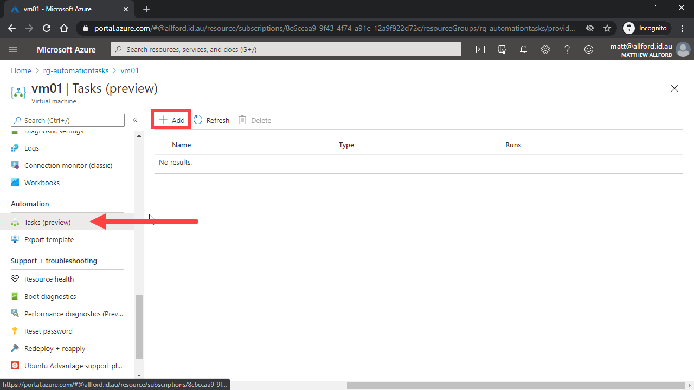

Several task templates will appear, which will differ depending on the type of resource you have selected. For a virtual machine, we see options for sending the monthly cost, starting the virtual machine, and powering off the virtual machine. Click on `Start Virtual Machine`, and then click `Next: Authentication`.

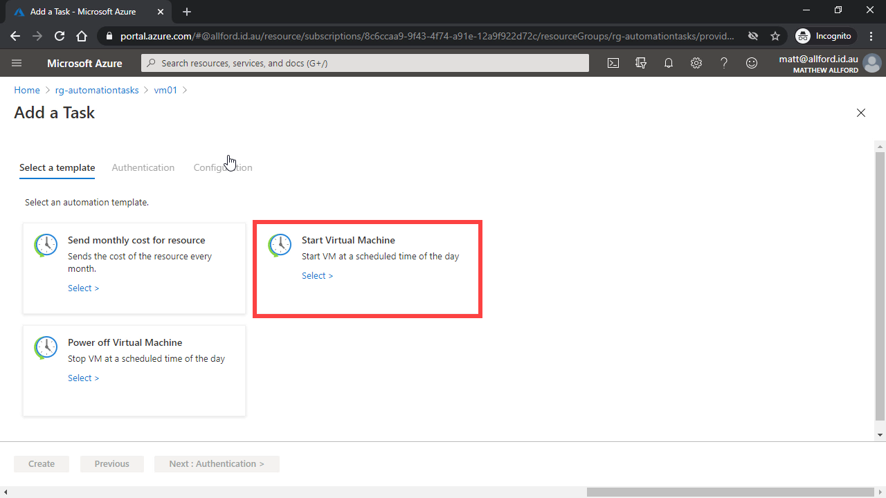

Depending on what the task is going to achieve, you will need to create one or more connections. Under the hood, these are creating Logic App API Connections to allow the logic app to interact with the desired resource, to perform the task. The `Start Virtual Machine` task requires you to create an Azure VM connection, as well as an Office 365 Outlook connection. The latter is used to send an email notification, but even if you don't want the email, at this point you still need to configure that connection to be able to create the Automation Task. Click on create, and then under Create Connection, click on sign in. You will be asked to sign in with your Azure account.

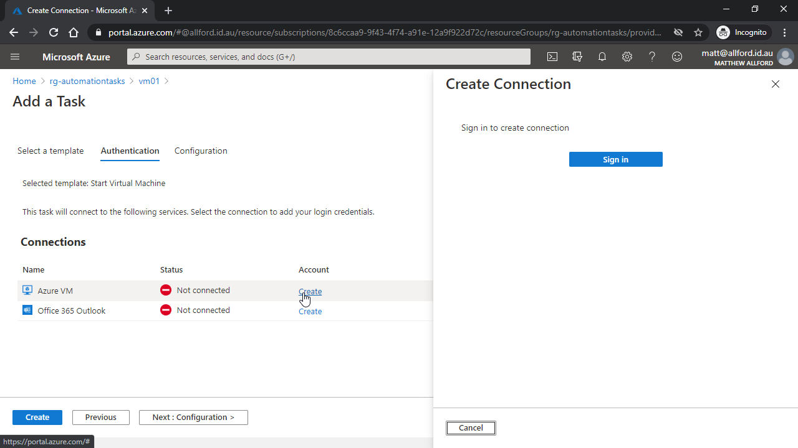

After configuring the connections, the connection status will change to connected.

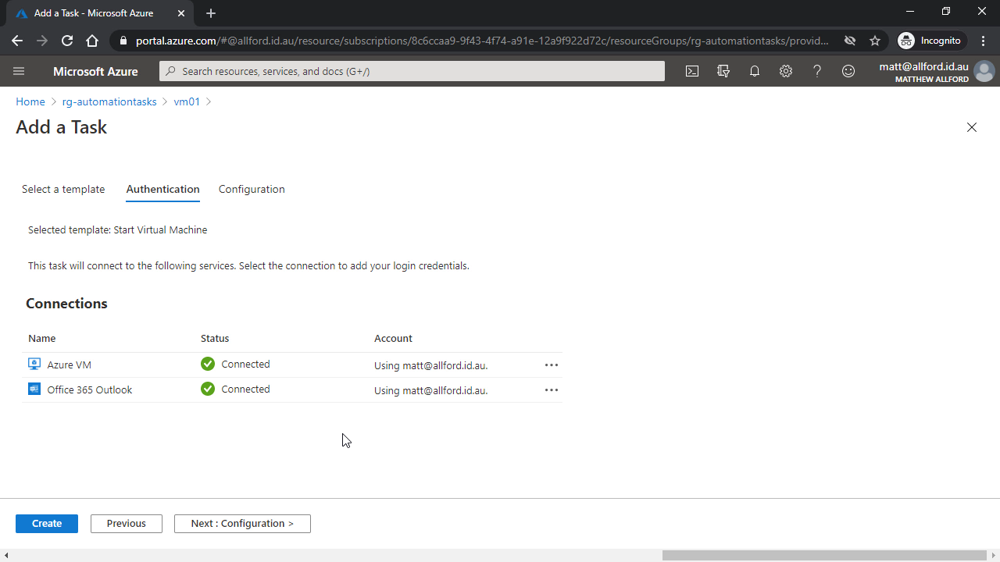

The final step is to input values for the configuration of the task. These will differ based on the task, but for this example, you need to input a task name, which cannot be changed after the task is created, the time to start the task and the time zone, followed by the interval of how often you want to run the task. In this example, I'm setting the virtual machine to start every 24 hours. If you want to see the task trigger ASAP, I'd suggest setting the start time for a few minutes from now. Optionally, you can configure the task to notify you after every run. After filling out the configuration, click on `Create` to provision the task.

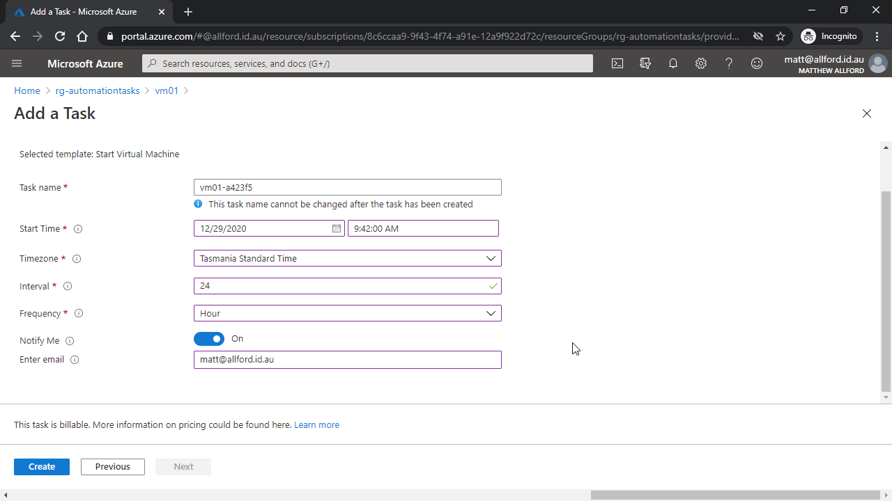

You get returned to the `Tasks` blade on the Azure resource and will see the new task that has been created.

## Viewing Task History

You'll find that after configuring an Automation Task, you will occasionally want to be able to view the history of the task, especially if any failures require investigation.

The history of a task can be shown by clicking on `view` for the selected task.

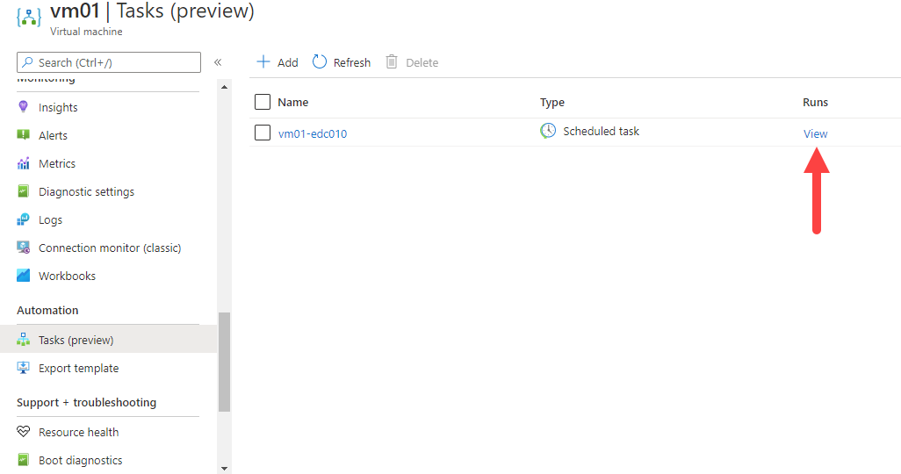

You will be presented with the history of runs for that specific Automation Task, with a summary of the status, start time, and duration of the task.

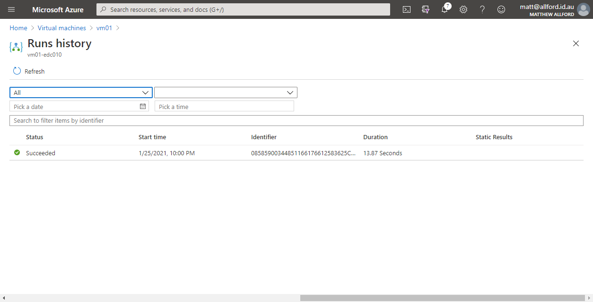

You can click on an individual result from this page, and you will be taken into the Logic App run for that specific run of the task, where you can see the details of the task run. This will be helpful if any troubleshooting is required for your tasks, as you can view the inputs and outputs for each step in the task.

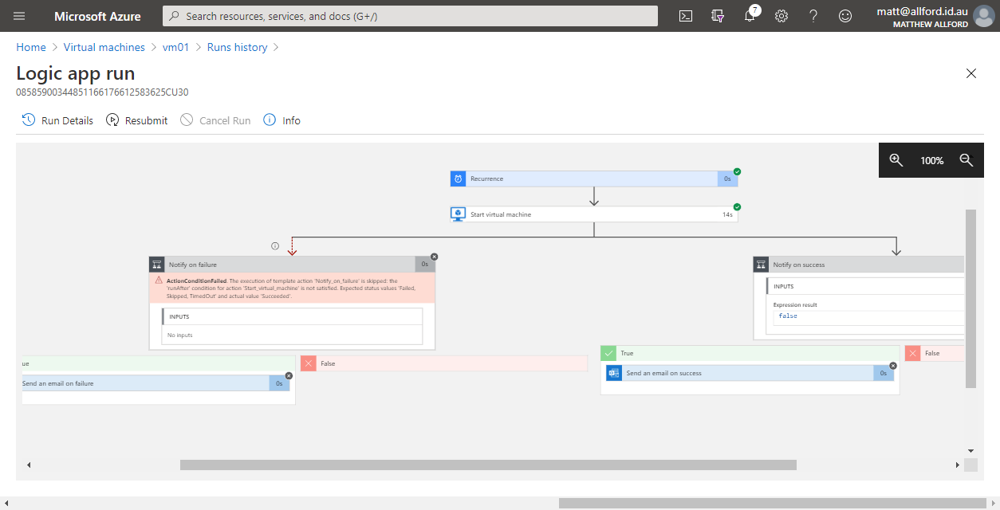

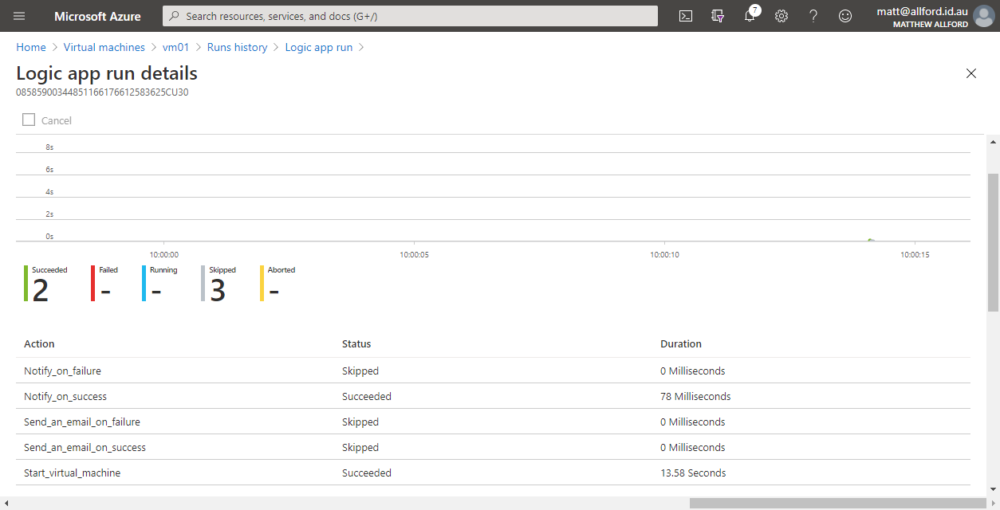

## Editing an Automation Task

You may find that after you have created an Automation Task, you will want to edit that task. It might be a simple change, like modifying the interval, or the time that it runs. Alternatively, you might want to tweak the steps in the task to achieve a slightly different goal than what is being performed by the templated task. Let's look at how to achieve both of these objectives.

For a simple edit of the task, you can click on the ellipsis for the task you want to edit, and then choose `Edit in-line`. This will take you through the same workflow as when you created the task, allowing you to edit the connections and the basic configuration of the task.

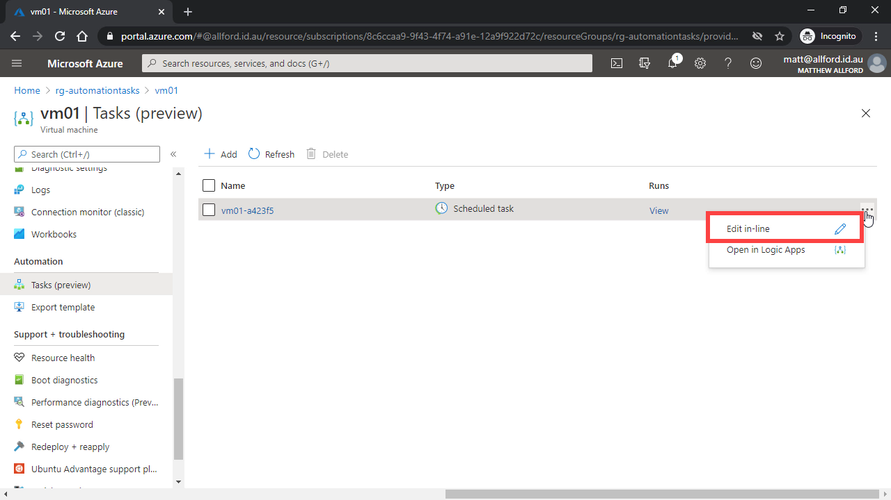

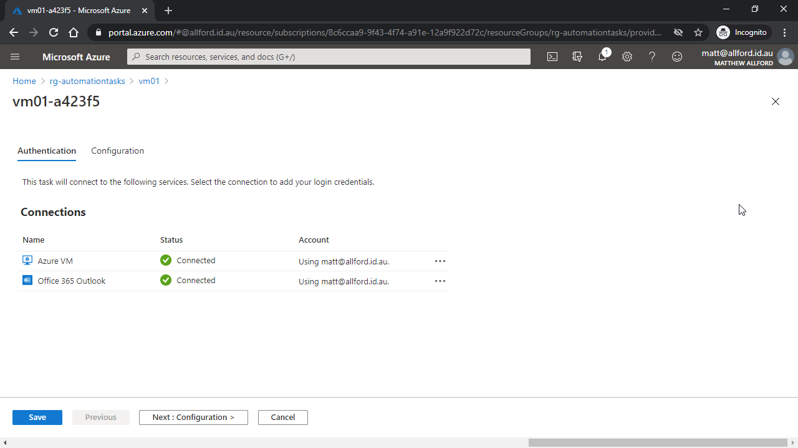

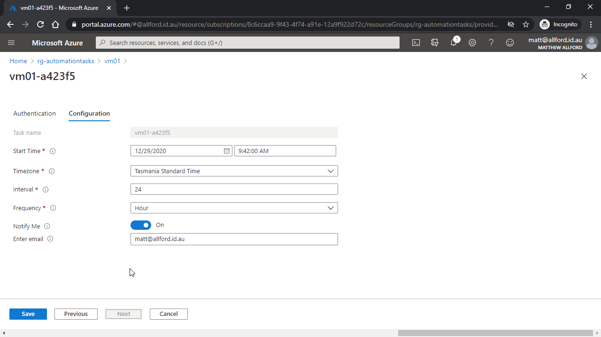

If you want to make changes to the underlying steps that the task is performing, you can choose to edit the task in Logic Apps, which will allow you to use the Logic App designer and code to change the task. If you choose to do this, it can be a good idea to clone the logic app first, and test your changes there, before you modify the logic app linked to the Automation Task. 

To edit the Automation Task in logic apps, click on the ellipsis for the task, and this time click on `Open in Logic Apps`.

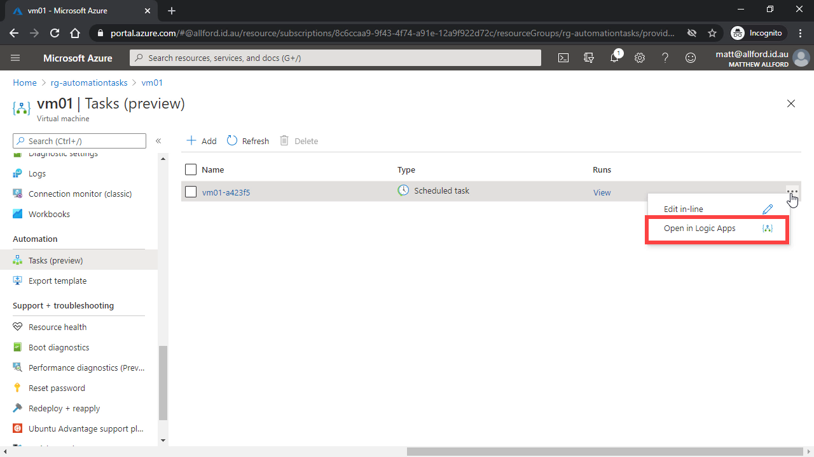

You get taken to the overview page for the underlying logic app of this Automation Task, where you can view the run information, metrics, and the steps that comprise this task. To clone the app, there is an option at the top of the overview pane:

In the left-hand side menu, you can use the Logic App Designer to get a visual understanding of the steps and logic that the task will perform, and you can make changes to the workflow here. When you're finished making changes, make sure to click on save to save the logic app configuration.

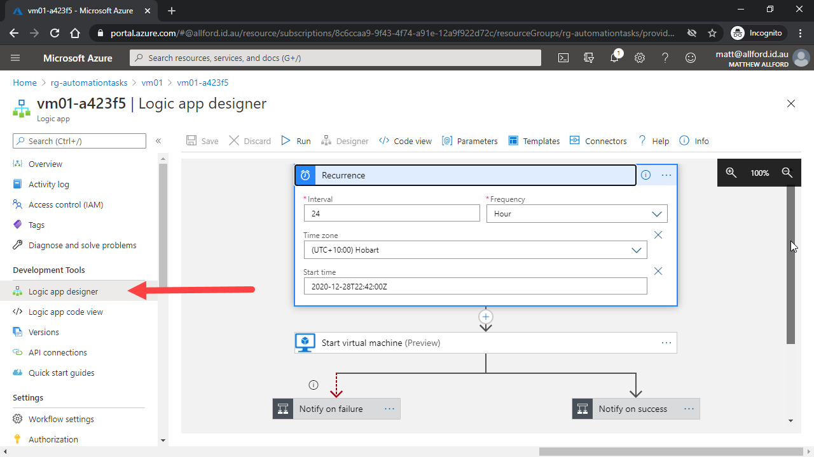

Note that if you do make changes, you are only making changes to the Automation Task that is linked to this specific logic app. You aren't making changes to the underlying template in Azure, so if you had deployed 5 automation tasks to power on 5 different virtual machines, and wanted to make a change to the underlying workflow, you'd need to make that change 5 times in each logic app.

## Conclusion

In this post, you learned what an Azure Automation task is, configured an Automation Task to power on a virtual machine, and explored options for editing an existing Automation Task. Now you can start to experiment with automation tasks in Azure to make your life easier!

I like the idea behind this new feature, which is to surface pre-configured workflows for popular management capabilities in Azure. Over time, I'd like to see some sort of public library to be made available, where community members can submit Automation Tasks that can be consumed via the Azure Portal. Keep in mind that depending on what you are trying to achieve, something like Azure Automation might be more suitable for centralized and scalable management when compared to Automation Tasks, which are currently a per-resource configuration.