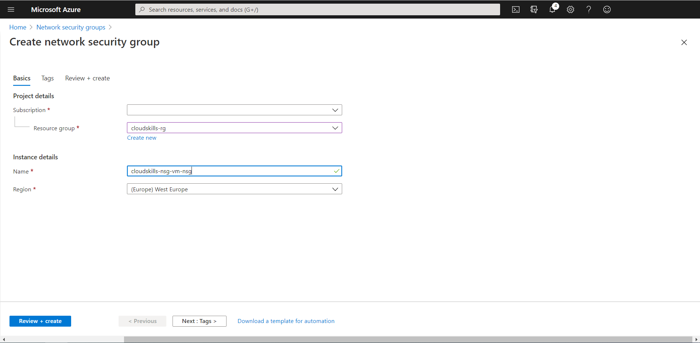
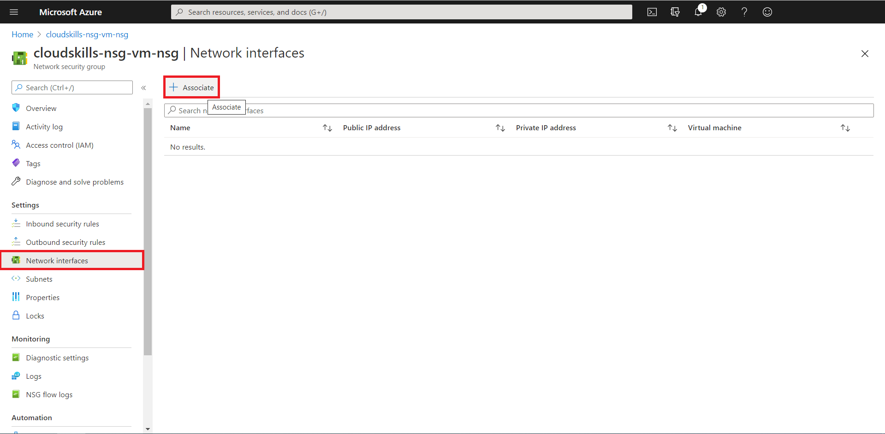
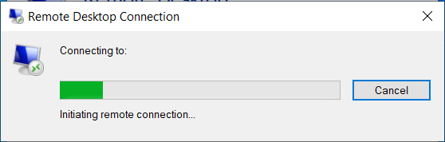
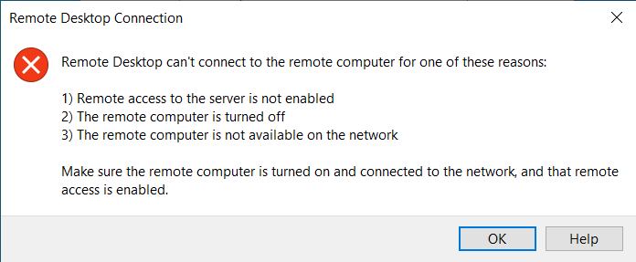
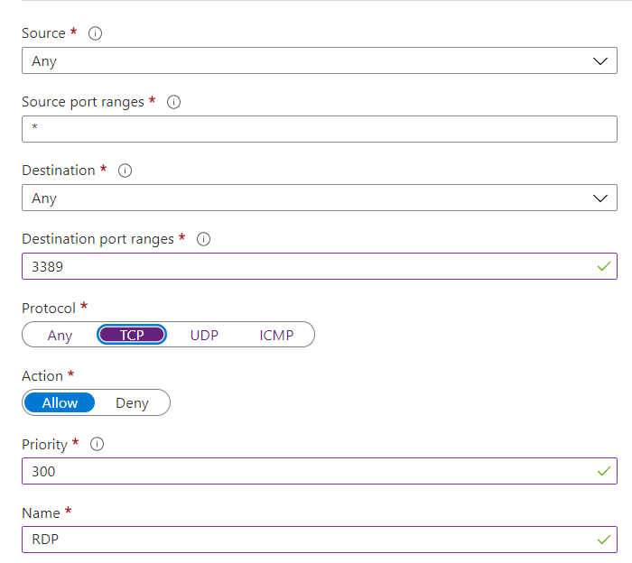
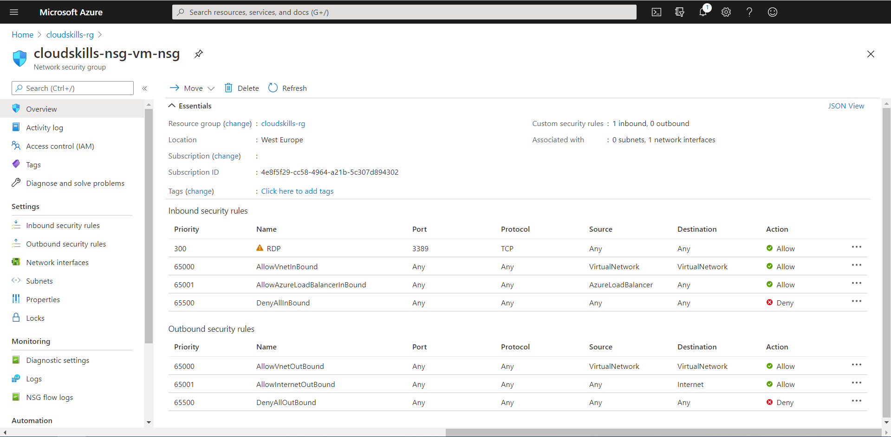
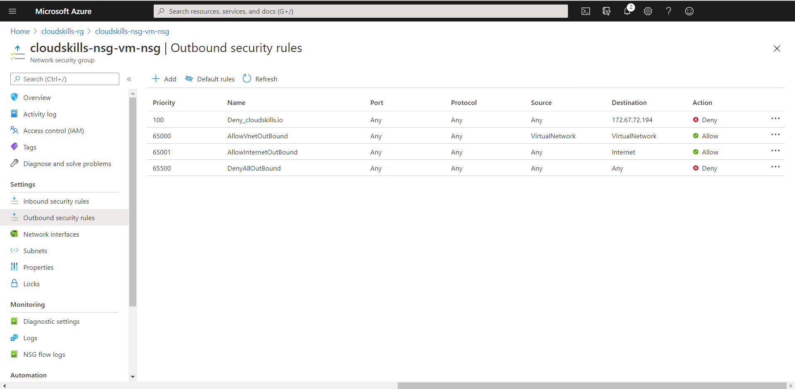
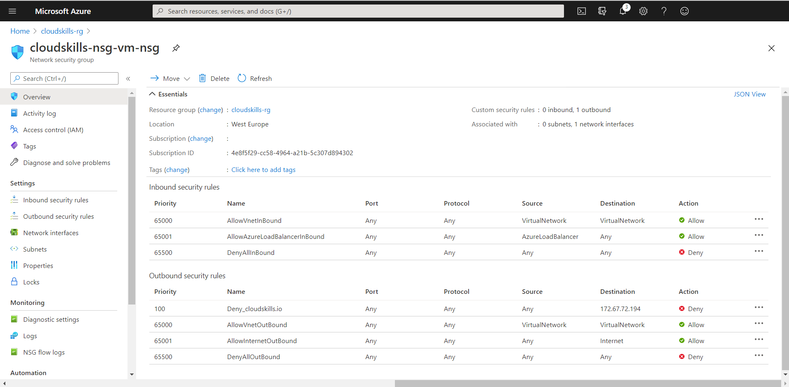
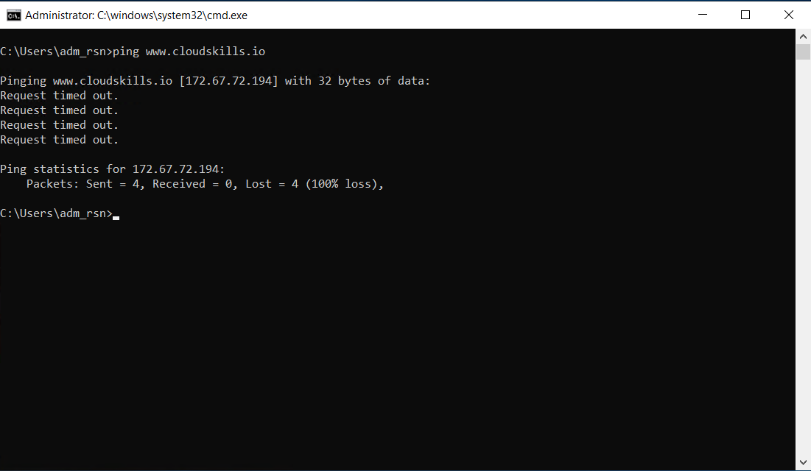

# Getting started with Azure Network Security Groups

Do you lock your front door when you leave home? What would international security look like if there were no customs and security at airports? What is the value of a bouncer at your local dance club, who greets all guests kindly but does not check for identity and gun possession? You probably have an opinion on these topics that will not differ widely from my own. We all want to feel safe, and this is high on the agenda of many organizations. All the stranger is that when it comes to information technology, the door is often opened wide to the world, and the firewall (if any) neatly greets everyone and lets them in.

The range of techniques to manage the security of an Azure environment is enormous. Even with the security services that focus primarily on inbound and outbound traffic, there is still plenty to choose from. One of the choices is to use Network Security Groups (NSG). With NSGs, Microsoft has found a simple, yet very effective, way to manage inbound and outbound traffic.

In this guide, you will learn what Azure Network Security Groups are, and how they might help you manage your Azure environment more securely. When you’re finished, you’ll be able to control inbound and outbound traffic from and to your Azure resources using Network Security Groups.

## Prerequisites 
To get started with Azure Network Security Groups, you’ll need the following:
* A Microsoft Azure account, where you have Owner, Contributor, or at least Network Contributor role privileges. To learn more about Role-Based Access Control, [see this link](https://docs.microsoft.com/en-us/azure/role-based-access-control/overview?WT.mc_id=thomasmaurer-blog-thmaure). 
* A properly configured virtual network. If you want to know how to create a virtual network in Azure, [see this link](https://docs.microsoft.com/en-us/azure/virtual-network/quick-create-template).
* A virtual machine (VM) into a subnet.

## Creating a Network Security Group
A Network Security Group is a set of security rules for allowing or denying incoming and outgoing traffic and can be used to filter network traffic to and from Azure resources in an Azure virtual network. For each rule, you can specify the source and destination, port, and protocol. You link a Network Security Group to a network interface (NIC) that is attached to your Virtual Machine (VM) or a subnet within a virtual network (VNET).

First, log in to the [Azure Portal](https://portal.azure.com) and create a Network Security Group.

Once created, you will associate the NSG with the NIC of a VM of choice. Select the "Network interfaces" option from the settings list on the left, click on "Associate" on the top, and select the resource (NIC) that is attached to your VM of choice.

You now successfully have associated your Network Security Group, with its default security rules, to your virtual machines network interface. When you open the NSG you've just created, you will see it's default rules. The rules permit all the hosts inside the virtual network to communicate between them, allows an Azure load balancer to communicate with your VM and send heartbeats, and denies any further inbound traffic. 

	

Based on the priority code (from low to high), lines at the top are processed first. When a rule is applicable, further rules will no longer be processed. In the example above, line 65001 will not be processed if the traffic is coming from the same virtual network, even if it is an Azure Load Balancer. In that case, 65000 is applicable, applied and further rules will be skipped. 

## Allowing and denying certain traffic
In the next steps, you will control traffic by creating rules to allow and deny certain traffic. 

### Allowing Remote Desktop Protocol traffic
For educational purposes, you will configure the Network Security Group to allow all inbound Remote Desktop Protocol (RDP) traffic. First, test the possibility to connect to your VM to where the NSG is applied. It should deny you to connect to the Remote Desktop of the machine.

In your Network Security Group resource in the Azure Portal, select the "Inbound security rules" option from the settings list on the left, click on "Add" on the top, and fill in the parameters to allow the RDP traffic. In our example, you'll be allowing all RDP traffic from any Source to any Destination.

To allow RDP traffic to the VM, you'll need to make a rule in the NSG that applies before other rules that deny RDP traffic. You'll need a priority higher than 65500. Furthermore, RDP traffic communicates through port 3389, so you'll want to apply the rule to the listening port 3389.

You now successfully created your first security rule within your Network Security Group. With this rule, you should now be able to connect to your VM using the RDP-protocol. As the Remote Desktop Protocol is constantly abused by malicious parties, you should remove this rule at the end of this guide, or right now. If you're looking for a service that provides secure and seamless RDP and SSH access to your virtual machines directly through the Azure Portal, you might want to consider [Azure Bastion](https://cloudskills.io/blog/azure-bastion).

### Block ping to cloudskills.io
For educational purposes, you will configure the Network Security Group to deny all outbound ping traffic to the IP-adress of cloudskills.io. First, test the possibility to ping to cloudskills.io on your VM where the NSG is applied. It should allow you to ping cloudskills.io.

In your Network Security Group resource in the Azure Portal, select the "Outbound security rules" option from the settings list on the left, click on "Add" on the top, and fill in the parameters to deny the ping [(ICMP)](https://docs.microsoft.com/en-us/windows-server/administration/windows-commands/ping) traffic to the IP-adress of cloudskills.io. In our example, you'll be denying all traffic from any Source to the IP-adress of cloudskills.io.

To deny ICMP traffic to cloudskills.io, you'll need to make a rule in the NSG that applies before other rules that allow traffic. You'll need a priority higher than 65001. Furthermore, ICMP traffic has no port concept, so you'll want to apply the rule to all ports.

You now successfully created a rule within your Network Security Group to block access to cloudskills.io. Obviously you need cloudskills.io in your life and therefore should delete this rule immediatly.

## Things to take in consideration
You can attach one NSG to each subnet and network interface in a virtual machine. The same network security group can be associated with other subnets and network interfaces. Network Security Groups do have limitations, as the maximum number of rules by default is 200. You can raise the number of maximum rules to 1000 by raising a ticket with Microsoft.

Network interfaces within a subnet with a linked NSG can still have their own NSG associated with the network interface. Incoming traffic first enters the subnet and then the network interface. Outbound traffic first goes through the network interface and then the subnet. Deny rules aren't processed by the next set of rules on the "next NSG". If you allow incoming traffic on a subnet level and then deny it on the network interface level, traffic is denied for that specific network interface.

Security rules in an NSG attached to a subnet can affect connectivity between VMs in it. For example, if a rule is added to an NSG that rejects all incoming and outgoing traffic, virtual machines can no longer communicate with each other. Another line would need to be added specifically to make this possible.

Now you can use Network Security Groups to filter and manage incoming and outgoing traffic for your virtual network. Network Security Groups provide a simple and effective way to manage network traffic.

